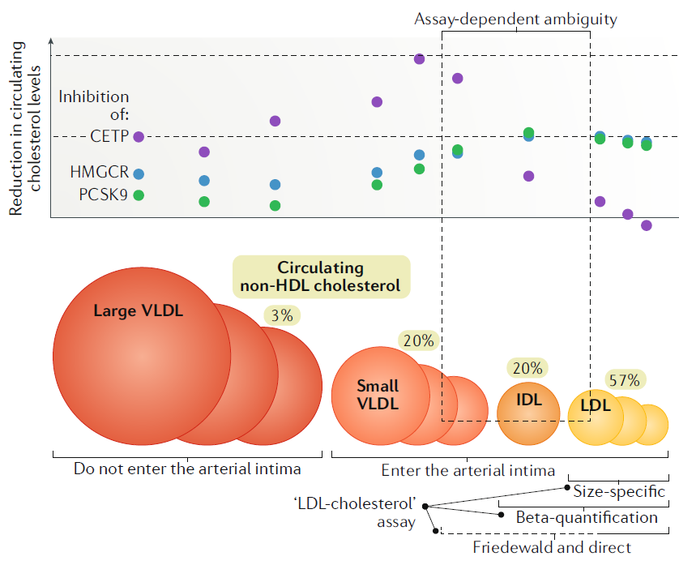

```{r setup, include=FALSE, warning=FALSE, message=FALSE}
knitr::opts_chunk$set(include = FALSE)
library(MRChallenge2019)
library(ggplot2)
library(MendelianRandomization)
require(knitr)
require(rmarkdown)
require(bookdown)
require(styler)
library(ggpubr)
library(mvmeta)
library(meta)
library(dplyr)
library(diagram)
library(MVMR)
library(kableExtra)
source("mvmr2.R")
```

```{r}
data(Challenge_dat)
beta_mat <- Challenge_dat[32:149]
p_mat <- Challenge_dat[150:267]

### Outcomes 
out_ybeta<- cbind(Challenge_dat$beta_amd,Challenge_dat$beta_alz,Challenge_dat$beta_t2d,Challenge_dat$beta_isch,Challenge_dat$beta_las,Challenge_dat$beta_ces,Challenge_dat$beta_svs)

out_yse<- cbind(Challenge_dat$se_amd,Challenge_dat$se_alz,Challenge_dat$se_t2d,Challenge_dat$se_isch,Challenge_dat$se_las,Challenge_dat$se_ces,Challenge_dat$se_svs)

## exposures (LDLs)
ldl_xbeta<- cbind(beta_mat[30],beta_mat[32],beta_mat[33],beta_mat[42],beta_mat[43],beta_mat[45],beta_mat[46],beta_mat[66],beta_mat[68],beta_mat[69],beta_mat[86])

ldl_pval<- cbind(p_mat[30],p_mat[32],p_mat[33],p_mat[42],p_mat[43],p_mat[45],p_mat[46],p_mat[66],p_mat[68],p_mat[69],p_mat[86])

## exposures (HDLs)
hdl_xbeta <- cbind(beta_mat[37],beta_mat[39],beta_mat[40],beta_mat[60],beta_mat[61],beta_mat[63],beta_mat[64],beta_mat[82],beta_mat[83],beta_mat[103],beta_mat[104],beta_mat[106],beta_mat[107],beta_mat[108])

hdl_pval <- cbind(p_mat[37],p_mat[39],p_mat[40],p_mat[60],p_mat[61],p_mat[63],p_mat[64],p_mat[82],p_mat[83],p_mat[103],p_mat[104],p_mat[106],p_mat[107],p_mat[108])
```

# Participants

- Okezie Uche-Ikonne, Department of Mathematics and Statistics, Lancaster University, Lancaster, UK, o.uche-ikonne@lancaster.ac.uk
- Michael Holmes, Medical Research Council Population Health Research Unit at the University of Oxford, Oxford, UK.
- Frank Dondelinger, Faculty of Health and Medicine, Lancaster University, Lancaster, UK.
- Tom Palmer, Department of Mathematics and Statistics, Lancaster University, Lancaster, UK.

# Motivation

There has been considerable research on the role of blood lipids and their associations with various cardiovascular traits [@holmesajkd2018]. While observational analyses have led to naïve classifications of "good" (higher density lipoprotein, HDL) and "bad" (lower density lipoprotein, LDL) blood lipids, the underlying causal relationships suggest that while LDL and triglycerides may have atherogenic characteristics, HDL-cholesterol is unlikely to play an important role in atherogenesis.

The [MRDataChallenge](https://www.mendelianrandomization.org.uk/the-mr-data-challenge-2019/) provides a summary level dataset by which contains the associations of genotypes (comprising 148 SNPs) with lipid traits and the associations of genotypes with 7 outcomes [@mrchallenge2019]. Of the seven outcomes, we selected ischemic stroke to investigate the casual relationship of LDL and HDL lipid traits using the Mendelian randomization (MR) approach [@daveysmith]. Figures \@ref(fig:dag1) and \@ref(fig:dag2) represent the DAGs for the proposed analysis. 

```{r dag1, include=TRUE, echo=FALSE, fig.align='center', fig.cap="Directed acyclic graph (DAG) of the MR analysis to investigate the effect of LDL to ischemic stroke."}
DiagrammeR::grViz("
      digraph mrdag {

      graph [rankdir=TB, layout=neato]

      node [shape=box,eight=0.3, width=0.3]
      U [label='Confounders', pos='3,1!']
      
      node [shape=box, height=0.5, width=0.5]
      Y1 [label='Ischemic Stroke', pos='4,0!']

      node [shape=box, height=0.3, width=0.3]
      G1 [label='G@_{1}', pos='0,1!']
	    G2 [label='G@_{2}', pos='0,0!']
	    G3 [label='G@_{3}', pos='0,-1!']
      X1 [label='LDL', pos='2,0!']
      
      { rank = same;  Y1 }

      G1 -> {X1}
	    G2 -> {X1}
	    G3 -> {X1}
      U -> X1
      U -> Y1
      X1 -> {Y1}
      
      }
      ", height = 300)
```

```{r dag2, include=TRUE, echo=FALSE, fig.align='center', fig.cap="DAG representing the MR analysis for the effect of HDL on ischemic stroke."}
DiagrammeR::grViz("
      digraph mrdag {

      graph [rankdir=TB, layout=neato]

      node [shape=box,eight=0.3, width=0.3]
      U [label='Confounders', pos='3,1!']
      
      node [shape=box, height=0.5, width=0.5]
      Y1 [label='Ischemic Stroke', pos='4,0!']

      node [shape=box, height=0.3, width=0.3]
      G1 [label='G@_{1}', pos='0,1!']
	    G2 [label='G@_{2}', pos='0,0!']
	    G3 [label='G@_{3}', pos='0,-1!']
      X1 [label='HDL', pos='2,0!']
      
      { rank = same;  Y1 }

      G1 -> {X1}
	    G2 -> {X1}
	    G3 -> {X1}
      U -> X1
      U -> Y1
      X1 -> {Y1}
      
      }
      ", height = 300)
```

One cause of ischaemic stroke is the development of atherosclerosis, in which build-up of fatty deposits in the arterial wall leads to development of a plaque, which can disrupt the supply of oxygenated blood flow to the brain. There is strong evidence that LDL-related lipid phenotypes are causally implicated in the aetiology of atherosclerosis and coronary heart disease.

In a recent comment piece, @holmes2019ldl discussed that there is a size dependent threshold whereby lipid species that are bigger than small VLDLs, are too large to enter the arterial intima, as shown in Figure \@ref(fig:holmes2019fig1). Therefore, in our analysis we focused our investigation on those lipid species smaller than small VLDL: i.e. IDL and LDL. In addition, we wished to assess the causal relevance of HDL species.

```{r, holmes2019fig1, fig.cap='Figure 1 of @holmes2019ldl showing which sizes of lipid trait enter the arterial intima.', include=TRUE, echo=FALSE, fig.align='center'}

```

# Data

The MR Challenge data consists of summary data of the association of 148 genotypes with 118 lipid traits and 7 outcomes. We have trimmed the number of exposures used. Our low-density lipoprotein (LDL) analysis consists of 11 exposures whilst we have used 14 lipid traits associated with high-density lipoproteins (HDL). 

The atherogenic lipid traits we investigated are;

  * Concentration of IDL particles
  * Free cholesterol in IDL
  * Cholesterol esters in large LDL
  * Free cholesterol in large LDL
  * Phospholipids in IDL
  * Concentration of Large LDL particles
  * Phospholipids in large LDL
  * Cholesterol esters in medium LDL
  * Concentration of medium LDL particles
  * Phospholipids in medium LDL
  * Concentration of small LDL particles.

The lipid traits related to HDL that we investigated are;

  * Cholesterol esters in large HDL           
  * Concentration of large HDL particles
  * Phospholipids in large HDL 
  * Cholesterol esters in medium HDL          
  * Free cholesterol in medium HDL            
  * Concentration of medium HDL particles     
  * Phospholipids in medium HDL               
  * Concentration of small HDL particles      
  * Triglycerides in small HDL
  * Cholesterol esters in very large HDL      
  * Free cholesterol in very large HDL      
  * Concentration of very large HDL particles 
  * Phospholipids in very large HDL           
  * Triglycerides in very large HDL.

# Analysis Methods

We used the inverse variance weighted (IVW) method to estimate the causal effect in summary-level data [@burgess2013mendelian]. The IVW model is denoted in equation \@ref(eq:IVW) where for a genotype $j$, $\widehat\Gamma_j$ represents the estimated genotype-outcome associations, $\widehat\gamma_j$ represents the estimated genotype-phenotype associations, and $\sigma_{yj}$ represents the estimated standard errors of the genotype-outcome associations.

$$
\frac{\hat{\Gamma}_{j}}{\sigma_{y_j}} = \frac{\beta\gamma_j}{\sigma_{y_j}} + \varepsilon_j, \quad \varepsilon_j \sim N(0,1)
(\#eq:IVW)
$$

We perform sensitivity analysis for our IVW estimates using the MR-Egger model [@bowden2015mendelian]. The MR-Egger model is an extension of the IVW model \@ref(eq:IVW) which includes the average pleiotropic effect as an intercept. By convention the residual variance is constrained to be greater than 1, which usually means that the MR-Egger model gives larger standard errors on its estimated causal effect than the IVW model. Equation \@ref(eq:egger) denotes the MR-Egger model.

$$
\frac{\hat{\Gamma}_{j}}{\sigma_{y_j}} = \frac{\beta_0}{\sigma_{y_j}} + \frac{\beta\gamma_j}{\sigma_{y_j}} + \varepsilon_j, \quad \varepsilon_j \sim N(0,\sigma^2)
(\#eq:egger)
$$
We also investigated causal effects of lipid traits adjusted for other traits using the multivariable MR (MVMR) method [@burgess2015re] as shown in equation \@ref(eq:mvmrr).
$$
\hat{\Gamma}_j = \beta_1\hat{\gamma}_{1,j} + \beta_2\hat{\gamma}_{2,j} + \varepsilon_j, \quad \varepsilon_j \sim N(0,\sigma^2).
(\#eq:mvmrr)
$$

To select which of the 148 genotypes to include in our analysis we took two approaches:

i. We selected genotypes with genome-wide significant p-values ($p < 5 \times 10^{-8}$) with the specific lipid trait of interest. These results are in [Section 4](#section4);
ii. We also selected genotypes based upon their individual contribution towards the Q-statistic, for either the IVW or MR-Egger model [@bowden2018improving]. Therefore, in this case we selected genotypes with Q-statistic p-values $\geq 0.05$. These results are in [Section 5](#section5).

We investigated the causal effect of each selected lipid trait and we then perform a meta-analysis our causal effect estimates according to their size and their specific trait.

```{r}
########## Functions ##########

#Function for GWAS significant snps
sieve <- function(xbeta,pval,ybeta,yse){
  df = cbind(xbeta,pval,ybeta,yse)
  dat = subset(df, pval < 5e-8, select = c(xbeta,pval,ybeta,yse))
  dat2 = na.exclude(dat)
  return(dat2)
}

#Function for IVW
ivw <- function(x, xse, y, yse) {
  dat = mr_input(x, xse, y, yse)
  mrivw = MendelianRandomization::mr_ivw(dat)
  est = mrivw@Estimate
  se = mrivw@StdError
  LCI = mrivw@CILower
  UCI = mrivw@CIUpper
  Pval = mrivw@Pvalue
  snps = mrivw@SNPs
  ans = c(est, se, LCI, UCI, Pval, snps)
  ans = round(ans, digits = 4)
  return(ans)
}

#Function for MR-Egger
mregger <- function(x, xse, y, yse) {
  dat = mr_input(x, xse, y, yse)
  mregger = MendelianRandomization::mr_egger(dat)
  int = mregger@Intercept
  int_se = mregger@StdError.Int
  int_LI = mregger@CILower.Int
  int_UI = mregger@CIUpper.Int
  int_pval = mregger@Pvalue.Int
  est = mregger@Estimate
  se = mregger@StdError.Est
  LCI = mregger@CILower.Est
  UCI = mregger@CIUpper.Est
  est_pval = mregger@Pvalue.Est
  AvgPleio = c(int, int_se,int_LI,int_UI,int_pval)
  Causal = c(est, se, LCI, UCI, est_pval)
  ans = rbind(AvgPleio,Causal)
  return(ans)
}

## Selecting genetic variants based on their individual contribution to Q-statistics

selectsnp<- function(rsid,xbeta,ybeta,yse){
  
  dat = data.frame(rsid,xbeta,ybeta,yse)
  #dat = na.exclude(dat)
  
  # ratio estimate
  ratio = ybeta/xbeta
  # first order weights
  weight = (xbeta/yse)^2
  # Multiplication of weights and ratio estimate
  ratweight = ratio * sqrt(weight)
  # Estimating causality using IVW
  causal = summary(lm(ratweight ~ 0 + sqrt(weight)))$coef[1]
  # Calculating individual Q-statistics
  Qj = weight * (ratio - causal)^2
  # Define chi-square test 
  chi_Qj = 0
  # Chi-squared test for each Q-stats
  for( i in 1:length(Qj)){
    chi_Qj[i] = pchisq(Qj[i],1,lower.tail = FALSE)
  }
  
  
   # indicating outlier for each Q-stats
   # outlier <- rep(0,length(dat[,2]))
   
   dat$Qj <- Qj
   dat$chi_Qj <- chi_Qj
   dat$outlier <- rep(0,length(dat[,1]))
   
   dat = na.exclude(dat)
   
   alpha = 0.05

   for (i in 1:length(dat[,1])){
     if(dat$chi_Qj[i]<alpha) {
       dat$outlier[i] <- 1
     }
   }

  # Extracting non-outliers based on their Q contribution
   dat$Outlier<-factor(dat$outlier)
   levels(dat$Outlier)[levels(dat$Outlier)=="0"] <- "Variant"
   levels(dat$Outlier)[levels(dat$Outlier)=="1"] <- "Outlier"
   
   
  dat_out = subset(dat, Outlier == "Variant")

  return(dat_out)
}

## sieving snps with GWAS signficant values
ldl_mat1<-sieve(ldl_xbeta[,1],ldl_pval[,1],out_ybeta[,4],out_yse[,4])
ldl_mat2<-sieve(ldl_xbeta[,2],ldl_pval[,2],out_ybeta[,4],out_yse[,4])
ldl_mat3<-sieve(ldl_xbeta[,3],ldl_pval[,3],out_ybeta[,4],out_yse[,4])
ldl_mat4<-sieve(ldl_xbeta[,4],ldl_pval[,4],out_ybeta[,4],out_yse[,4])
ldl_mat5<-sieve(ldl_xbeta[,5],ldl_pval[,5],out_ybeta[,4],out_yse[,4])
ldl_mat6<-sieve(ldl_xbeta[,6],ldl_pval[,6],out_ybeta[,4],out_yse[,4])
ldl_mat7<-sieve(ldl_xbeta[,7],ldl_pval[,7],out_ybeta[,4],out_yse[,4])
ldl_mat8<-sieve(ldl_xbeta[,8],ldl_pval[,8],out_ybeta[,4],out_yse[,4])
ldl_mat9<-sieve(ldl_xbeta[,9],ldl_pval[,9],out_ybeta[,4],out_yse[,4])
ldl_mat10<-sieve(ldl_xbeta[,10],ldl_pval[,10],out_ybeta[,4],out_yse[,4])
ldl_mat11<-sieve(ldl_xbeta[,11],ldl_pval[,11],out_ybeta[,4],out_yse[,4])

hdl_mat1<-sieve(hdl_xbeta[,1],hdl_pval[,1],out_ybeta[,4],out_yse[,4])
hdl_mat2<-sieve(hdl_xbeta[,2],hdl_pval[,2],out_ybeta[,4],out_yse[,4])
hdl_mat3<-sieve(hdl_xbeta[,3],hdl_pval[,3],out_ybeta[,4],out_yse[,4])
hdl_mat4<-sieve(hdl_xbeta[,4],hdl_pval[,4],out_ybeta[,4],out_yse[,4])
hdl_mat5<-sieve(hdl_xbeta[,5],hdl_pval[,5],out_ybeta[,4],out_yse[,4])
hdl_mat6<-sieve(hdl_xbeta[,6],hdl_pval[,6],out_ybeta[,4],out_yse[,4])
hdl_mat7<-sieve(hdl_xbeta[,7],hdl_pval[,7],out_ybeta[,4],out_yse[,4])
hdl_mat8<-sieve(hdl_xbeta[,8],hdl_pval[,8],out_ybeta[,4],out_yse[,4])
hdl_mat9<-sieve(hdl_xbeta[,9],hdl_pval[,9],out_ybeta[,4],out_yse[,4])
hdl_mat10<-sieve(hdl_xbeta[,10],hdl_pval[,10],out_ybeta[,4],out_yse[,4])
hdl_mat11<-sieve(hdl_xbeta[,11],hdl_pval[,11],out_ybeta[,4],out_yse[,4])
hdl_mat12<-sieve(hdl_xbeta[,12],hdl_pval[,12],out_ybeta[,4],out_yse[,4])
hdl_mat13<-sieve(hdl_xbeta[,13],hdl_pval[,13],out_ybeta[,4],out_yse[,4])
hdl_mat14<-sieve(hdl_xbeta[,14],hdl_pval[,14],out_ybeta[,4],out_yse[,4])

# Selecting instruments using their individual Q-statistics LDLs
ldlsnps_Q<-selectsnp(Challenge_dat$rsid,ldl_xbeta[,1],out_ybeta[,4],out_yse[,4])
ldlsnps_Q1<-selectsnp(Challenge_dat$rsid,ldl_xbeta[,2],out_ybeta[,4],out_yse[,4])
ldlsnps_Q2<-selectsnp(Challenge_dat$rsid,ldl_xbeta[,3],out_ybeta[,4],out_yse[,4])
ldlsnps_Q3<-selectsnp(Challenge_dat$rsid,ldl_xbeta[,4],out_ybeta[,4],out_yse[,4])
ldlsnps_Q4<-selectsnp(Challenge_dat$rsid,ldl_xbeta[,5],out_ybeta[,4],out_yse[,4])
ldlsnps_Q5<-selectsnp(Challenge_dat$rsid,ldl_xbeta[,6],out_ybeta[,4],out_yse[,4])
ldlsnps_Q6<-selectsnp(Challenge_dat$rsid,ldl_xbeta[,7],out_ybeta[,4],out_yse[,4])
ldlsnps_Q7<-selectsnp(Challenge_dat$rsid,ldl_xbeta[,8],out_ybeta[,4],out_yse[,4])
ldlsnps_Q8<-selectsnp(Challenge_dat$rsid,ldl_xbeta[,9],out_ybeta[,4],out_yse[,4])
ldlsnps_Q9<-selectsnp(Challenge_dat$rsid,ldl_xbeta[,10],out_ybeta[,4],out_yse[,4])
ldlsnps_Q10<-selectsnp(Challenge_dat$rsid,ldl_xbeta[,11],out_ybeta[,4],out_yse[,4])

#HDLs
hdlsnps_Q<-selectsnp(Challenge_dat$rsid,hdl_xbeta[,1],out_ybeta[,4],out_yse[,4])
hdlsnps_Q1<-selectsnp(Challenge_dat$rsid,hdl_xbeta[,2],out_ybeta[,4],out_yse[,4])
hdlsnps_Q2<-selectsnp(Challenge_dat$rsid,hdl_xbeta[,3],out_ybeta[,4],out_yse[,4])
hdlsnps_Q3<-selectsnp(Challenge_dat$rsid,hdl_xbeta[,4],out_ybeta[,4],out_yse[,4])
hdlsnps_Q4<-selectsnp(Challenge_dat$rsid,hdl_xbeta[,5],out_ybeta[,4],out_yse[,4])
hdlsnps_Q5<-selectsnp(Challenge_dat$rsid,hdl_xbeta[,6],out_ybeta[,4],out_yse[,4])
hdlsnps_Q6<-selectsnp(Challenge_dat$rsid,hdl_xbeta[,7],out_ybeta[,4],out_yse[,4])
hdlsnps_Q7<-selectsnp(Challenge_dat$rsid,hdl_xbeta[,8],out_ybeta[,4],out_yse[,4])
hdlsnps_Q8<-selectsnp(Challenge_dat$rsid,hdl_xbeta[,9],out_ybeta[,4],out_yse[,4])
hdlsnps_Q9<-selectsnp(Challenge_dat$rsid,hdl_xbeta[,10],out_ybeta[,4],out_yse[,4])
hdlsnps_Q10<-selectsnp(Challenge_dat$rsid,hdl_xbeta[,11],out_ybeta[,4],out_yse[,4])
hdlsnps_Q11<-selectsnp(Challenge_dat$rsid,hdl_xbeta[,12],out_ybeta[,4],out_yse[,4])
hdlsnps_Q12<-selectsnp(Challenge_dat$rsid,hdl_xbeta[,13],out_ybeta[,4],out_yse[,4])
hdlsnps_Q13<-selectsnp(Challenge_dat$rsid,hdl_xbeta[,14],out_ybeta[,4],out_yse[,4])
```

# Results

## GWAS-significant genotype-phenotype associations {#section4}

### IVW estimates

```{r}
### IVW for LDL
ldl_ivw1<-ivw(ldl_mat1[,1],ldl_mat1[,1],ldl_mat1[,3],ldl_mat1[,4])
ldl_ivw2<-ivw(ldl_mat2[,1],ldl_mat2[,2],ldl_mat2[,3],ldl_mat2[,4])
ldl_ivw3<-ivw(ldl_mat3[,1],ldl_mat3[,2],ldl_mat3[,3],ldl_mat3[,4])
ldl_ivw4<-ivw(ldl_mat4[,1],ldl_mat4[,2],ldl_mat4[,3],ldl_mat4[,4])
ldl_ivw5<-ivw(ldl_mat5[,1],ldl_mat5[,2],ldl_mat5[,3],ldl_mat5[,4])
ldl_ivw6<-ivw(ldl_mat6[,1],ldl_mat6[,2],ldl_mat6[,3],ldl_mat6[,4])
ldl_ivw7<-ivw(ldl_mat7[,1],ldl_mat7[,2],ldl_mat7[,3],ldl_mat7[,4])
ldl_ivw8<-ivw(ldl_mat8[,1],ldl_mat8[,2],ldl_mat8[,3],ldl_mat8[,4])
ldl_ivw9<-ivw(ldl_mat9[,1],ldl_mat9[,2],ldl_mat9[,3],ldl_mat9[,4])
ldl_ivw10<-ivw(ldl_mat10[,1],ldl_mat10[,2],ldl_mat10[,3],ldl_mat10[,4])
ldl_ivw11<-ivw(ldl_mat11[,1],ldl_mat11[,2],ldl_mat11[,3],ldl_mat11[,4])

tab <- rbind(ldl_ivw1,ldl_ivw2,ldl_ivw3,ldl_ivw4,ldl_ivw5,ldl_ivw6,ldl_ivw7,ldl_ivw8,ldl_ivw9,ldl_ivw10,ldl_ivw11)
lipid_traits <- c(
  "Free cholesterol in IDL",                    
  "Concentration of IDL particles",           
  "Phospholipids in IDL",                       
  "Cholesterol esters in large LDL",
  "Free cholesterol in large LDL",
  "Concentration of large LDL particles",
  "Phospholipids in large LDL",
  "Cholesterol esters in medium LDL",
  "Concentration of medium LDL particles",
  "Phospholipids in medium LDL",
  "Concentration of small LDL particles"
  )

tab <- cbind (lipid_traits,unname(tab))
colnames(tab) <- c("Exposures","Estimate", "SE","LI","UI", "Pval","SNPs")

### HDLs##
hdl_ivw1<-ivw(hdl_mat1[,1],hdl_mat1[,2],hdl_mat1[,3],hdl_mat1[,4])
hdl_ivw2<-ivw(hdl_mat2[,1],hdl_mat2[,2],hdl_mat2[,3],hdl_mat2[,4])
hdl_ivw3<-ivw(hdl_mat3[,1],hdl_mat3[,2],hdl_mat3[,3],hdl_mat3[,4])
hdl_ivw4<-ivw(hdl_mat4[,1],hdl_mat4[,2],hdl_mat4[,3],hdl_mat4[,4])
hdl_ivw5<-ivw(hdl_mat5[,1],hdl_mat5[,2],hdl_mat5[,3],hdl_mat5[,4])
hdl_ivw6<-ivw(hdl_mat6[,1],hdl_mat6[,2],hdl_mat6[,3],hdl_mat6[,4])
hdl_ivw7<-ivw(hdl_mat7[,1],hdl_mat7[,2],hdl_mat7[,3],hdl_mat7[,4])
hdl_ivw8<-ivw(hdl_mat8[,1],hdl_mat8[,2],hdl_mat8[,3],hdl_mat8[,4])
hdl_ivw9<-ivw(hdl_mat9[,1],hdl_mat9[,2],hdl_mat9[,3],hdl_mat9[,4])
hdl_ivw10<-ivw(hdl_mat10[,1],hdl_mat10[,2],hdl_mat10[,3],hdl_mat10[,4])
hdl_ivw11<-ivw(hdl_mat11[,1],hdl_mat11[,2],hdl_mat11[,3],hdl_mat11[,4])
hdl_ivw12<-ivw(hdl_mat12[,1],hdl_mat12[,2],hdl_mat12[,3],hdl_mat12[,4])
hdl_ivw13<-ivw(hdl_mat13[,1],hdl_mat13[,2],hdl_mat13[,3],hdl_mat13[,4])
hdl_ivw14<-ivw(hdl_mat14[,1],hdl_mat14[,2],hdl_mat14[,3],hdl_mat14[,4])

tab1 <- rbind(hdl_ivw1,hdl_ivw2,hdl_ivw3,hdl_ivw4,hdl_ivw5,hdl_ivw6,hdl_ivw7,hdl_ivw8,hdl_ivw9,hdl_ivw10,hdl_ivw11,hdl_ivw12,hdl_ivw13,hdl_ivw14)
traits <- c(
  "Cholesterol esters in large HDL",
  "Concentration of large HDL particles",
  "Phospholipids in large HDL",
  "Cholesterol esters in medium HDL",
  "Free cholesterol in medium HDL",
  "Concentration of medium HDL particles",
  "Phospholipids in medium HDL",
  "Concentration of small HDL particles",
  "Triglycerides in small HDL",
  "Cholesterol esters in very large HDL",
  "Free cholesterol in very large HDL",
  "Concentration of very large HDL particles",
  "Phospholipids in very large HDL",
  "Triglycerides in very large HDL"
  )

tab1 <- cbind(traits, unname(tab1))
colnames(tab1) <- c("Exposures","Estimate", "SE","LI","UI", "Pval", "SNPs")
```

IVW estimates of the causal effect of lipid fractions related to LDLs are shown in Table \@ref(tab:tab) and Figure \@ref(fig:pl1). We can see from the SNPs column that the number of selected SNPs is small for all the traits. The MR point estimates are positive which means that on average a higher level of LDL related lipid is related to a higher risk of ischemic stroke (since the associations are risk estimates on the log scale). However, the estimates all report confidence intervals spanning the null. The positive point estimates concur with our scientific expectations as the atherogenic characteristic increase the risk of ischemic stroke. However, more instruments would be needed to increase the statistical power of these estimates. 

```{r tab, include=TRUE, echo=FALSE}
tab <- as.data.frame(tab)

tab %>%
  mutate(SNPs =  ifelse (
  as.numeric(as.character(SNPs)) < 2,
  cell_spec(as.numeric(as.character(SNPs)), color = "white", background = "grey"),
  cell_spec(as.numeric(as.character(SNPs)), color = "black", background = "white")
  ))%>%
  mutate(Estimate =  ifelse (
  as.numeric(as.character(Estimate)) < 0,
  cell_spec(as.numeric(as.character(Estimate)), color = "black", background = "grey"),
  cell_spec(as.numeric(as.character(Estimate)), color = "black", background = "white")
  ))%>%
  kable("html",escape = F, caption = "IVW estimates for exposures related LDLs", digits = 4)%>%
  kable_styling("striped", full_width = TRUE)
```


```{r}
tabx <-
  rbind(
    ldl_ivw1,
    ldl_ivw2,
    ldl_ivw3,
    ldl_ivw4,
    ldl_ivw5,
    ldl_ivw6,
    ldl_ivw7,
    ldl_ivw8,
    ldl_ivw9,
    ldl_ivw10,
    ldl_ivw11
  )
tabg <-
  data.frame(
    Estimates = tabx[, 1],
    SE = tabx[, 2],
    LI = tabx[, 3],
    UI = tabx[, 4],
    exposures = lipid_traits
  )

pl1 <-
  ggplot() + geom_pointrange(data = tabg, aes(
    x = exposures,
    y = Estimates,
    ymin = LI,
    ymax = UI
  )) + xlab("Exposures") + ylab("Estimates") + ggtitle("LDLs") + coord_flip() + geom_hline(yintercept =
                                                                                             0, lty = 2)
```

```{r, pl1, include=TRUE, echo=FALSE, fig.align='center', fig.cap="IVW Estimates for LDLs"}
pl1
```

Table \@ref(tab:tab1) and Figure \@ref(fig:pl2) show causal estimates of lipid fractions related to the HDLs. These point estimates are generally negative with confidence intervals spanning the null. In the Table shaded cells indicate a small number of genotypes, which is of interest because the MR-Egger estimator cannot be performed with these lipid traits due to the low number of instruments.

```{r tab1, include=TRUE, echo=FALSE}
tab1 <- as.data.frame(tab1)

tab1 %>%
  mutate(SNPs =  ifelse (
  as.numeric(SNPs) < 3,
  cell_spec(SNPs, color = "white", background = "grey"),
  cell_spec(SNPs, color = "black", background = "white")
  ))%>%
  mutate(Estimate =  ifelse (
  as.numeric(as.character(Estimate)) > 0.01,
  cell_spec(as.numeric(as.character(Estimate)), color = "white", background = "grey"),
  cell_spec(as.numeric(as.character(Estimate)), color = "black", background = "white")
  ))%>%
  kable("html",escape = F, caption = "IVW estimates for exposures related HDLs", digits = 4)%>%
  kable_styling("striped", full_width = TRUE)
```

```{r}
tabx1 <- rbind(hdl_ivw1,hdl_ivw2,hdl_ivw3,hdl_ivw4,hdl_ivw5,hdl_ivw6,hdl_ivw7,hdl_ivw8,hdl_ivw9,hdl_ivw10,hdl_ivw11,hdl_ivw12,hdl_ivw13,hdl_ivw14)
tabg1 <- data.frame(Estimates = tabx1[,1], SE = tabx1[,2], LI = tabx1[,3], UI = tabx1[,4], exposures = traits)

pl2 <- ggplot(data=tabg1, aes(x=exposures,y=Estimates, ymin=LI, ymax=UI)) + geom_pointrange() +xlab("Exposures")+ ylab("Estimates") + ggtitle("HDLs") + coord_flip() + geom_hline(yintercept=0, lty=2)
```

```{r, pl2, include=TRUE, echo=FALSE, fig.align='center', fig.cap="IVW Estimates for HDLs"}
pl2
```

### MR-Egger estimates

```{r}
ldl_mregger1<-mregger(ldl_mat1[,1],ldl_mat1[,2],ldl_mat1[,3],ldl_mat1[,4])
ldl_mregger2<-mregger(ldl_mat2[,1],ldl_mat2[,2],ldl_mat2[,3],ldl_mat2[,4])
ldl_mregger3<-mregger(ldl_mat3[,1],ldl_mat3[,2],ldl_mat3[,3],ldl_mat3[,4])
ldl_mregger4<-mregger(ldl_mat4[,1],ldl_mat4[,2],ldl_mat4[,3],ldl_mat4[,4])
ldl_mregger5<-mregger(ldl_mat5[,1],ldl_mat5[,2],ldl_mat5[,3],ldl_mat5[,4])
ldl_mregger6<-mregger(ldl_mat6[,1],ldl_mat6[,2],ldl_mat6[,3],ldl_mat6[,4])
ldl_mregger7<-mregger(ldl_mat7[,1],ldl_mat7[,2],ldl_mat7[,3],ldl_mat7[,4])
ldl_mregger8<-mregger(ldl_mat8[,1],ldl_mat8[,2],ldl_mat8[,3],ldl_mat8[,4])
ldl_mregger9<-mregger(ldl_mat9[,1],ldl_mat9[,2],ldl_mat9[,3],ldl_mat9[,4])
ldl_mregger10<-mregger(ldl_mat10[,1],ldl_mat10[,2],ldl_mat10[,3],ldl_mat10[,4])
ldl_mregger11<-mregger(ldl_mat11[,1],ldl_mat11[,2],ldl_mat11[,3],ldl_mat11[,4])

tabk <- rbind(ldl_mregger1,ldl_mregger2,ldl_mregger3,ldl_mregger4,ldl_mregger5,ldl_mregger6,ldl_mregger7,ldl_mregger8,ldl_mregger9,ldl_mregger10,ldl_mregger11)
colnames(tabk) <- c("Estimate", "SE","LI","UI", "Pval")

### HDLs##
hdl_mregger1<-mregger(hdl_mat1[,1],hdl_mat1[,2],hdl_mat1[,3],hdl_mat1[,4])
hdl_mregger2<-mregger(hdl_mat2[,1],hdl_mat2[,2],hdl_mat2[,3],hdl_mat2[,4])
hdl_mregger3<-mregger(hdl_mat3[,1],hdl_mat3[,2],hdl_mat3[,3],hdl_mat3[,4])
hdl_mregger4<-mregger(hdl_mat11[,1],hdl_mat11[,2],hdl_mat11[,3],hdl_mat11[,4])
hdl_mregger5<-mregger(hdl_mat13[,1],hdl_mat13[,2],hdl_mat13[,3],hdl_mat13[,4])

tabk1 <- rbind(hdl_mregger1,hdl_mregger2,hdl_mregger3,hdl_mregger4,hdl_mregger5)
colnames(tabk1) <- c("Estimate", "SE","LI","UI", "Pval")
```

In this section, we use the MR-Egger model to perform sensitivity analysis for the IVW estimates. Table \@ref(tab:tabk) shows estimates from the MR-Egger model for lipid fractions related to LDLs. In general the point estimates are positive and larger in magnitude than the IVW estimates. The one exception is the point estimate for phospholipids in medium LDL, which shows a negative causal estimate with a confidence interval spanning the null. We find no strong evidence against the null hypothesis of no pleiotropy, since the estimates of the intercepts (`AvgPleio`) are all close to the null with large p-values.

```{r tabk, include=TRUE, echo=FALSE, fig.align='center'}
# tabe1 <- kable(tab1, digits = 3)
# kable_styling(tabe1, "striped", position = "center")

kable(tabk, caption = "MR-Egger estimates for LDL related phenotypes", digits = 4) %>%
  kable_styling("striped", full_width = T) %>%
  pack_rows("Free cholesterol in IDL", 1, 2) %>%
  pack_rows("Concentration of IDL particles", 3, 4) %>%
  pack_rows("Phospholipids in IDL", 5, 6) %>%
  pack_rows("Concentration of IDL particles", 7, 8) %>%
  pack_rows("Free cholesterol in large LDL", 9, 10) %>%
  pack_rows("Concentration of large LDL particles", 11, 12) %>%
  pack_rows("Phospholipids in large LDL", 13, 14) %>%
  pack_rows("Cholesterol esters in medium LDL", 15, 16) %>%
  pack_rows("Concentration of medium LDL particles", 17, 18) %>%
  pack_rows("Phospholipids in medium LDL", 19, 20) %>%
  pack_rows("Concentration of small LDL particles", 21, 22)
```

Sensitivity analysis of the lipid traits related to HDLs in Table \@ref(tab:tabk1) show negative point estimates with confidence intervals spanning the null. This would fit with a narrative of HDL either being protective or having a null effect on the risk of ischemic stroke, however the evidence against the null hypothesis is very weak.

```{r tabk1, include=TRUE, echo=FALSE, fig.align='center'}
kable(tabk1, caption = "MR-Egger estimates for HDL related phenotypes", digits = 4) %>%
  kable_styling("striped", full_width = T) %>%
  pack_rows("Cholesterol esters in large HDL", 1, 2) %>%
  pack_rows("Concentration of large HDL particles", 3, 4) %>%
  pack_rows("Phospholipids in large HDL", 5, 6) %>%
  pack_rows("Free cholesterol in very large HDL", 7, 8) %>%
  pack_rows("Phospholipids in very large HDL", 9, 10)
```

### Meta-analysis of exposure traits

In an attempt to increase statistical power, we performed a meta-analysis of the results by lipid category and molecular size.

#### Risk factor categories

```{r}
### LDL groups
###
con_ldl<- rbind(tabg[2,],tabg[6,],tabg[9,],tabg[11,])

ldlmetan2 <- metagen(Estimates,SE, data = con_ldl, studlab = paste(exposures), comb.fixed = FALSE, comb.random = TRUE,hakn = FALSE,prediction=TRUE,sm="SMD", method.tau = "REML", title = "Concentration")

###
pho_ldl <- rbind(tabg[3,],tabg[7,],tabg[10,])

ldlmetan3 <- metagen(Estimates,SE, data = pho_ldl, studlab = paste(exposures), comb.fixed = FALSE, comb.random = TRUE,hakn = FALSE,prediction=TRUE,sm="SMD", method.tau = "REML", title = "Phospholipids")

###
freechol_ldl <- rbind(tabg[1,],tabg[5,])

ldlmetan4 <- metagen(Estimates,SE, data = freechol_ldl, studlab = paste(exposures), comb.fixed = FALSE, comb.random = TRUE,hakn = FALSE,prediction=TRUE,sm="SMD", method.tau = "REML", title = "Free Cholesterol")

#plotmetan4<-meta::forest(ldlmetan4)

###
cholest_ldl <- rbind(tabg[4,],tabg[8,])

ldlmetan5 <- metagen(Estimates,SE, data = cholest_ldl, studlab = paste(exposures), comb.fixed = FALSE, comb.random = TRUE,hakn = FALSE,prediction=TRUE,sm="SMD", method.tau = "REML", title = "Cholesterol Esters")

#plotmetan5<-meta::forest(ldlmetan5)
resldlest2<-c(ldlmetan2$k,ldlmetan2$TE.random,ldlmetan2$seTE.random,ldlmetan2$lower.random,ldlmetan2$upper.random,round(ldlmetan2$pval.random, digits = 4))
resldlest3<-c(ldlmetan3$k,ldlmetan3$TE.random,ldlmetan3$seTE.random,ldlmetan3$lower.random,ldlmetan3$upper.random,round(ldlmetan3$pval.random, digits = 4))
resldlest4<-c(ldlmetan4$k,ldlmetan4$TE.random,ldlmetan4$seTE.random,ldlmetan4$lower.random,ldlmetan4$upper.random,round(ldlmetan4$pval.random, digits = 4))
resldlest5<-c(ldlmetan5$k,ldlmetan5$TE.random,ldlmetan5$seTE.random,ldlmetan5$lower.random,ldlmetan5$upper.random,round(ldlmetan5$pval.random, digits = 4))
tabff<- rbind(resldlest2,resldlest3,resldlest4,resldlest5)
colnames(tabff)<- c("N","Estimate", "SE","LI","UI","Pval")
rownames(tabff)<- c("Concentration", "Phospholipids","Free Cholesterol","Cholesterol esters")
```

Table \@ref(tab:tabff) shows results from the meta-analysis of the IVW estimates. The point estimates show null or positive estimates with confidence intervals spanning the null, however given the number of instruments the estimates show how despite the meta-analysis, the analyses yield imprecise causal estimates. Results in Table \@ref(tab:tabff1) are similar to the risk factor categories of LDLs. The point estimates show null or negative estimates with confidence intervals spanning the null.

```{r tabff, include=TRUE, echo=FALSE}
tabff <- as.data.frame(tabff)
tabff %>%
  kable("html",escape = F, caption = "Meta-analysis of IVW estimates from LDL related phenotypes", digits = 4)%>%
  kable_styling("striped", full_width = TRUE)
```

```{r}
### HDL groups
metatabg1<- cbind(tabg1,as.character(traits))
hdlmetan<-metagen(Estimates,SE, data = metatabg1, studlab = paste(exposures), comb.fixed = FALSE, comb.random = TRUE,hakn = FALSE,prediction=TRUE,sm="SMD", method.tau = "REML", title = "Total Cholesterol")

###
cholest_hdl<- rbind(tabg1[1,],tabg1[4,],tabg1[10,])

hdlmeta1<-metagen(Estimates,SE, data = cholest_hdl, studlab = paste(exposures), comb.fixed = FALSE, comb.random = TRUE,hakn = FALSE,prediction=TRUE,sm="SMD", method.tau = "REML", title = "Cholesterol esters")

###
freechol_hdl<- rbind(tabg1[5,], tabg1[11,])

hdlmeta2<-metagen(Estimates,SE, data = freechol_hdl, studlab = paste(exposures), comb.fixed = FALSE, comb.random = TRUE,hakn = FALSE,prediction=TRUE,sm="SMD", method.tau = "REML", title = "Free Cholesterol")

###
con_hdl<- rbind(tabg1[2,],tabg1[6,],tabg1[8,],tabg1[12,])

hdlmeta3<-metagen(Estimates,SE, data = con_hdl, studlab = paste(exposures), comb.fixed = FALSE, comb.random = TRUE,hakn = FALSE,prediction=TRUE,sm="SMD", method.tau = "REML", title = "Concentration")

###
pho_hdl<- rbind(tabg1[3,],tabg1[7,],tabg1[14,])

hdlmeta4<-metagen(Estimates,SE, data = pho_hdl, studlab = paste(exposures), comb.fixed = FALSE, comb.random = TRUE,hakn = FALSE,prediction=TRUE,sm="SMD", method.tau = "REML", title = "Phospholipids")

###
trig_hdl<- rbind(tabg1[9,],tabg1[14,])

hdlmeta5<-metagen(Estimates,SE, data = trig_hdl, studlab = paste(exposures), comb.fixed = FALSE, comb.random = TRUE,hakn = FALSE,prediction=TRUE,sm="SMD", method.tau = "REML", title = "Triglycerides")

reshdlest1<-c(hdlmeta1$k,hdlmeta1$TE.random,hdlmeta1$seTE.random,hdlmeta1$lower.random,hdlmeta1$upper.random,hdlmeta1$pval.random)
reshdlest2<-c(hdlmeta2$k,hdlmeta2$TE.random,hdlmeta2$seTE.random,hdlmeta2$lower.random,hdlmeta2$upper.random,hdlmeta2$pval.random)
reshdlest3<-c(hdlmeta3$k,hdlmeta3$TE.random,hdlmeta3$seTE.random,hdlmeta3$lower.random,hdlmeta3$upper.random,hdlmeta3$pval.random)
reshdlest4<-c(hdlmeta4$k,hdlmeta4$TE.random,hdlmeta4$seTE.random,hdlmeta4$lower.random,hdlmeta4$upper.random,hdlmeta4$pval.random)
reshdlest5<-c(hdlmeta5$k,hdlmeta5$TE.random,hdlmeta5$seTE.random,hdlmeta5$lower.random,hdlmeta5$upper.random,hdlmeta5$pval.random)

tabff1<- rbind(reshdlest1,reshdlest2,reshdlest3,reshdlest4,reshdlest5)
colnames(tabff1)<- c("N","Mean", "SE","LI","UI","Pval")
rownames(tabff1)<- c("Cholesterol Esters","Free Cholesterol", 
                "Concentration","phospholipids","Triglycerides")
```

```{r tabff1, include=TRUE, echo=FALSE}
tabff1 <- as.data.frame(tabff1)

tabff1 %>%
  kable("html",escape = F, caption = "Meta-analysis of IVW estimates for HDL related phenotypes", digits = 4)%>%
  kable_styling("striped", full_width = TRUE)
```

#### Sizes
```{r}
### LDL sizes
intermediate_ldl<- rbind(tabg[1,],tabg[2,],tabg[3,])
ldlsize1<- metagen(Estimates,SE, data = intermediate_ldl, studlab = paste(exposures), comb.fixed = FALSE, comb.random = TRUE,hakn = FALSE,prediction=TRUE,sm="SMD", method.tau = "REML", title = "Intermediate LDLs")

med_ldl<- rbind(tabg[8,],tabg[9,],tabg[10,])
ldlsize2<- metagen(Estimates,SE, data = med_ldl, studlab = paste(exposures), comb.fixed = FALSE, comb.random = TRUE,hakn = FALSE,prediction=TRUE,sm="SMD", method.tau = "REML", title = "Medium LDLs")

lar_ldl<- rbind(tabg[4,],tabg[5,],tabg[6,],tabg[7,])
ldlsize3<- metagen(Estimates,SE, data = lar_ldl, studlab = paste(exposures), comb.fixed = FALSE, comb.random = TRUE,hakn = FALSE,prediction=TRUE,sm="SMD", method.tau = "REML", title = "Large LDLs")

ldlsizes1<- c(ldlsize1$k,ldlsize1$TE.random,ldlsize1$seTE.random,ldlsize1$lower.random,ldlsize1$upper.random,round(ldlsize1$pval.random,digits = 4))
ldlsizes2<- c(ldlsize2$k,ldlsize2$TE.random,ldlsize2$seTE.random,ldlsize2$lower.random,ldlsize2$upper.random,round(ldlsize2$pval.random,digits = 4))
ldlsizes3<- c(ldlsize3$k,ldlsize3$TE.random,ldlsize3$seTE.random,ldlsize3$lower.random,ldlsize3$upper.random,round(ldlsize3$pval.random,digits = 4))
tabbf<- rbind(ldlsizes1,ldlsizes2,ldlsizes3)
colnames(tabbf)<- c("N","Mean", "SE","LI","UI","P-val")
rownames(tabbf)<- c("Intermediate","Medium","Large")
```

In this section we present result meta-analysing over the lipid traits for each size of molecule. LDL results are shown in Table \@ref(tab:tabbf). Similar to the risk factor categories in \@ref(tab:tabff) the sizes have null or positive causal estimate with no strong evidence against the null. Table \@ref(tab:tabbf) shows that the medium and large sized LDLs have a greater magnitude of effect than the intermediates sizes which matches our scientific rationale.

```{r, tabbf, include=TRUE, echo=FALSE}
tabbf <- as.data.frame(tabbf)

tabbf %>%
  kable("html",escape = F, caption = "Meta-analysis of IVW estimates for LDL sizes", digits = 4)%>%
  kable_styling("striped", full_width = TRUE)
```

```{r}
### HDL sizes
small_hdl<- rbind(tabg1[8,],tabg1[9,])
hdlsize1<- metagen(Estimates,SE, data = small_hdl, studlab = paste(exposures), comb.fixed = FALSE, comb.random = TRUE,hakn = FALSE,prediction=TRUE,sm="SMD", method.tau = "REML", title = "Small hdls")

med_hdl<- rbind(tabg1[4,],tabg1[5,],tabg1[6,],tabg1[7,])
hdlsize2<- metagen(Estimates,SE, data = med_hdl, studlab = paste(exposures), comb.fixed = FALSE, comb.random = TRUE,hakn = FALSE,prediction=TRUE,sm="SMD", method.tau = "REML", title = "Medium hdls")

lar_hdl<- rbind(tabg1[1,],tabg1[2,],tabg1[3,])
hdlsize3<- metagen(Estimates,SE, data = lar_hdl, studlab = paste(exposures), comb.fixed = FALSE, comb.random = TRUE,hakn = FALSE,prediction=TRUE,sm="SMD", method.tau = "REML", title = "Large hdls")

vlar_hdl<- rbind(tabg1[10,],tabg1[11,],tabg1[12,],tabg1[13,],tabg1[14,])
hdlsize4<- metagen(Estimates,SE, data = vlar_hdl, studlab = paste(exposures), comb.fixed = FALSE, comb.random = TRUE,hakn = FALSE,prediction=TRUE,sm="SMD", method.tau = "REML", title = "Very large hdls")

hdlsizes1<- c(hdlsize1$k,hdlsize1$TE.random,hdlsize1$seTE.random,hdlsize1$lower.random,hdlsize1$upper.random,round(hdlsize1$pval.random,digits = 4))
hdlsizes2<- c(hdlsize2$k,hdlsize2$TE.random,hdlsize2$seTE.random,hdlsize2$lower.random,hdlsize2$upper.random,round(hdlsize2$pval.random,digits = 4))
hdlsizes3<- c(hdlsize3$k,hdlsize3$TE.random,hdlsize3$seTE.random,hdlsize3$lower.random,hdlsize3$upper.random,round(hdlsize3$pval.random,digits = 4))
hdlsizes4<- c(hdlsize4$k,hdlsize4$TE.random,hdlsize4$seTE.random,hdlsize4$lower.random,hdlsize4$upper.random,round(hdlsize4$pval.random,digits = 4))
tabbf1<- rbind(hdlsizes1,hdlsizes2,hdlsizes3,hdlsizes4)
colnames(tabbf1)<- c("N","Mean", "SE","LI","UI","P-val")
rownames(tabbf1)<- c("Small","Medium","Large","Very Large")
```

For the HDL sizes in Table \@ref(tab:tabbf1) the point estimates show negative point estimates close to the null however none of the estimates are statistically significant. We find that the pooled point estimated for the very large HDL molecules is closest to the null.

```{r, tabbf1, include=TRUE, echo=FALSE, fig.align='center'}
tabbf1 <- as.data.frame(tabbf1)

tabbf1 %>%
  kable("html",escape = F, caption = "Meta-analysis of IVW estimates for HDL Sizes", digits = 4)%>%
  kable_styling("striped", full_width = TRUE)
```

### Multivariate Meta-analysis of MR-Egger estimates

```{r}
####  Free Cholesterol
betaldl1<- matrix(nrow = 2, ncol = 2, NA)

betaldl1[1,] <- c(tabk[1,1],tabk[2,1])
betaldl1[2,] <- c(tabk[9,1],tabk[10,1])

ldl1cov<- matrix(c((tabk[1,2])^2,0,0,(tabk[2,2])^2), byrow = T,ncol = 2)
ldl2cov<- matrix(c((tabk[9,2])^2,0,0,(tabk[10,2])^2), byrow = T,ncol = 2)

smatlist1<- list(ldl1cov, ldl2cov)
ldl1mvmeta<- mvmeta(betaldl1, smatlist1)

#### Concentration
betaldl3<- matrix(nrow = 4, ncol = 2, NA)

betaldl3[1,] <- c(tabk[3,1],tabk[4,1])
betaldl3[2,] <- c(tabk[11,1],tabk[12,1])
betaldl3[3,] <- c(tabk[17,1],tabk[18,1])
betaldl3[4,] <- c(tabk[21,1],tabk[22,1])

ldlvcoov<- matrix(c((tabk[3,2])^2,0,0,(tabk[4,2])^2), byrow = T,ncol = 2)
ldlvcoov1<- matrix(c((tabk[11,2])^2,0,0,(tabk[12,2])^2), byrow = T,ncol = 2)
ldlvcoov2<- matrix(c((tabk[17,2])^2,0,0,(tabk[18,2])^2), byrow = T,ncol = 2)
ldlvcoov3<- matrix(c((tabk[21,2])^2,0,0,(tabk[22,2])^2), byrow = T,ncol = 2)

smatlist3<- list(ldlvcoov, ldlvcoov1, ldlvcoov2, ldlvcoov3)
ldl3mvmeta<- mvmeta(betaldl3, smatlist3)

#### phospholipids
betaldl4<- matrix(nrow = 3, ncol = 2, NA)

betaldl4[1,] <- c(tabk[5,1],tabk[6,1])
betaldl4[2,] <- c(tabk[13,1],tabk[14,1])
betaldl4[3,] <- c(tabk[19,1],tabk[20,1])

ldl1coov<- matrix(c((tabk[5,2])^2,0,0,(tabk[6,2])^2), byrow = T,ncol = 2)
ldl2coov<- matrix(c((tabk[13,2])^2,0,0,(tabk[14,2])^2), byrow = T,ncol = 2)
ldl3coov<- matrix(c((tabk[19,2])^2,0,0,(tabk[20,2])^2), byrow = T,ncol = 2)

smatlist4<- list(ldl1coov, ldl2coov, ldl3coov)
ldl4mvmeta<- mvmeta(betaldl4, smatlist4)

#### Cholesterol esters
betaldl5<- matrix(nrow = 2, ncol = 2, NA)

betaldl5[1,] <- c(tabk[7,1],tabk[8,1])
betaldl5[2,] <- c(tabk[15,1],tabk[16,1])

lddl1cov<- matrix(c((tabk[7,2])^2,0,0,(tabk[8,2])^2), byrow = T,ncol = 2)
lddl2cov<- matrix(c((tabk[15,2])^2,0,0,(tabk[16,2])^2), byrow = T,ncol = 2)

smatlist5<- list(lddl1cov, lddl2cov)
ldl5mvmeta<- mvmeta(betaldl5, smatlist5)

#### collate results
traits_ldlmvmeta <-
  rbind(
  c(ldlmetan2$k,unname(ldl1mvmeta$coefficients),summary(ldl1mvmeta)$coef[1, 4],summary(ldl1mvmeta)$coef[2, 4]),
  c(ldlmetan3$k,unname(ldl3mvmeta$coefficients),summary(ldl3mvmeta)$coef[1, 4],summary(ldl3mvmeta)$coef[2, 4]),
  c(ldlmetan4$k,unname(ldl4mvmeta$coefficients),summary(ldl4mvmeta)$coef[1, 4],summary(ldl4mvmeta)$coef[2, 4]),
  c(ldlmetan5$k,unname(ldl5mvmeta$coefficients),summary(ldl5mvmeta)$coef[1, 4],summary(ldl5mvmeta)$coef[2, 4])
  )
rownames(traits_ldlmvmeta)<- c("Free Cholesterol","Concentration","Phospholipids","Cholesterol esters")
colnames(traits_ldlmvmeta)<- c("N","AVg Pleio", "Slope", "Pval(Pleio)", "Pval(Est)")
```

We also present equivalent meta-analysis estimates for our MR-Egger results, the difference being that we use multivariate meta-analysis since the MR-Egger model returns 2 parameters (slope and intercept). The low number of MR-Egger estimates from the exposure traits related to HDL-related phenotypes meant that we could not report any estimates. The results of the risk factor categories in Table \@ref(tab:ldlmvmeta1) show no strong evidence against the null of no pleiotropy. Cholesterol esters show a greater effect on ischemic stroke within the different LDL traits. Table \@ref(tab:ldlmvmeta2) shows no strong evidence against the null hypothesis of no pleiotropy. The summary point estimates are bigger in magnitude than the IVW estimates in Table \@ref(tab:tabbf). The intermediate sized traits returned a positive estimate suggesting an increased risk of ischemic stroke.

```{r, ldlmvmeta1, include=TRUE, echo=FALSE}
traits_ldlmvmeta <- as.data.frame(traits_ldlmvmeta)

traits_ldlmvmeta %>%
  kable("html",escape = F, caption = "Results from Multivariate Meta-analysis of LDL related phenotypes", digits = 4)%>%
  kable_styling("striped", full_width = TRUE)
```

```{r}
## intermediate

ibetaldl<- matrix(nrow = 3, ncol = 2, NA)

ibetaldl[1,] <- c(tabk[1,1],tabk[2,1])
ibetaldl[2,] <- c(tabk[3,1],tabk[4,1])
ibetaldl[3,] <- c(tabk[5,1],tabk[6,1])

ildlcov1<- matrix(c((tabk[1,2])^2,0,0,(tabk[1,2])^2), byrow = T,ncol = 2)
ildlcov2<- matrix(c((tabk[3,2])^2,0,0,(tabk[4,2])^2), byrow = T,ncol = 2)
ildlcov3<- matrix(c((tabk[5,2])^2,0,0,(tabk[6,2])^2), byrow = T,ncol = 2)

smmatlist<- list(ildlcov1, ildlcov2, ildlcov3)
ildlmvmeta<- mvmeta(ibetaldl, smmatlist)

### Medium

mbetaldl<- matrix(nrow = 3, ncol = 2, NA)

mbetaldl[1,] <- c(tabk[15,1],tabk[16,1])
mbetaldl[2,] <- c(tabk[17,1],tabk[18,1])
mbetaldl[3,] <- c(tabk[19,1],tabk[20,1])

mldlcov1<- matrix(c((tabk[15,2])^2,0,0,(tabk[16,2])^2), byrow = T,ncol = 2)
mldlcov2<- matrix(c((tabk[17,2])^2,0,0,(tabk[18,2])^2), byrow = T,ncol = 2)
mldlcov3<- matrix(c((tabk[19,2])^2,0,0,(tabk[20,2])^2), byrow = T,ncol = 2)

smmatlist1<- list(mldlcov1,mldlcov2,mldlcov3)
sldlmvmeta1<- mvmeta(mbetaldl, smmatlist1)

### large

lbetaldl<- matrix(nrow = 4, ncol = 2, NA)

lbetaldl[1,] <- c(tabk[7,1],tabk[8,1])
lbetaldl[2,] <- c(tabk[9,1],tabk[10,1])
lbetaldl[3,] <- c(tabk[11,1],tabk[12,1])
lbetaldl[4,] <- c(tabk[13,1],tabk[14,1])

lldlcov1<- matrix(c((tabk[7,2])^2,0,0,(tabk[8,2])^2), byrow = T,ncol = 2)
lldlcov2<- matrix(c((tabk[9,2])^2,0,0,(tabk[10,2])^2), byrow = T,ncol = 2)
lldlcov3<- matrix(c((tabk[11,2])^2,0,0,(tabk[12,2])^2), byrow = T,ncol = 2)
lldlcov4<- matrix(c((tabk[13,2])^2,0,0,(tabk[14,2])^2), byrow = T,ncol = 2)

smmatlist2<- list(lldlcov1,lldlcov2,lldlcov3,lldlcov4)
sldlmvmeta2<- mvmeta(lbetaldl, smmatlist2)

sizes_ldlmvmeta <-
  rbind(
  c(ldlsize1$k,
  unname(ildlmvmeta$coefficients),
  summary(ildlmvmeta)$coef[1, 4],
  summary(ildlmvmeta)$coef[2, 4]
  ),
  c(ldlsize2$k,
  unname(sldlmvmeta1$coefficients),
  summary(sldlmvmeta1)$coef[1, 4],
  summary(sldlmvmeta1)$coef[2, 4]
  ),
  c(ldlsize3$k,
  unname(sldlmvmeta2$coefficients),
  summary(sldlmvmeta2)$coef[1, 4],
  summary(sldlmvmeta2)$coef[2, 4]
  )
  )

rownames(sizes_ldlmvmeta)<- c("Intermediate", "Medium", "Large")
colnames(sizes_ldlmvmeta)<- c("N","Avg Pleio", "Estimate", "Pval(Pleio)", "Pval(Est)")
```

```{r, ldlmvmeta2, include=TRUE, echo=FALSE}
sizes_ldlmvmeta <- as.data.frame(sizes_ldlmvmeta)

sizes_ldlmvmeta %>%
  kable("html",escape = F, caption = "Multivariate meta-analysis of MR-Egger estimates for LDL sizes", digits = 4)%>%
  kable_styling("striped", full_width = TRUE)
```


## Selecting genetic variants using Q-statistics {#section5}

As most of the results presented hitherto have lacked statistical power, we therefore sought to increase the number of SNPs used as instruments, with the hope of increasing power, through the use of Q-statistics. This section presents results using genotypes based on their contribution to the Q-statistic in the IVW models.

### IVW estimates

The estimates from the IVW model are given in Tables \@ref(tab:ldlivwQ) and \@ref(tab:hdlivwQ).
```{r}
ldlQ_ivw <- ivw(ldlsnps_Q[,2],ldlsnps_Q[,4],ldlsnps_Q[,3],ldlsnps_Q[,4])
ldlQ_ivw1 <- ivw(ldlsnps_Q1[,2],ldlsnps_Q1[,4],ldlsnps_Q1[,3],ldlsnps_Q1[,4])
ldlQ_ivw2 <- ivw(ldlsnps_Q2[,2],ldlsnps_Q2[,4],ldlsnps_Q2[,3],ldlsnps_Q2[,4])
ldlQ_ivw3 <- ivw(ldlsnps_Q3[,2],ldlsnps_Q3[,4],ldlsnps_Q3[,3],ldlsnps_Q3[,4])
ldlQ_ivw4 <- ivw(ldlsnps_Q4[,2],ldlsnps_Q4[,4],ldlsnps_Q4[,3],ldlsnps_Q4[,4])
ldlQ_ivw5 <- ivw(ldlsnps_Q5[,2],ldlsnps_Q5[,4],ldlsnps_Q5[,3],ldlsnps_Q5[,4])
ldlQ_ivw6 <- ivw(ldlsnps_Q6[,2],ldlsnps_Q6[,4],ldlsnps_Q6[,3],ldlsnps_Q6[,4])
ldlQ_ivw7 <- ivw(ldlsnps_Q7[,2],ldlsnps_Q7[,4],ldlsnps_Q7[,3],ldlsnps_Q7[,4])
ldlQ_ivw8 <- ivw(ldlsnps_Q8[,2],ldlsnps_Q8[,4],ldlsnps_Q8[,3],ldlsnps_Q8[,4])
ldlQ_ivw9 <- ivw(ldlsnps_Q9[,2],ldlsnps_Q9[,4],ldlsnps_Q9[,3],ldlsnps_Q9[,4])
ldlQ_ivw10 <- ivw(ldlsnps_Q10[,2],ldlsnps_Q10[,4],ldlsnps_Q10[,3],ldlsnps_Q10[,4])

ldlivwQ<- rbind(ldlQ_ivw,ldlQ_ivw1,ldlQ_ivw2,ldlQ_ivw3,ldlQ_ivw4,ldlQ_ivw5,ldlQ_ivw6,ldlQ_ivw7,ldlQ_ivw8,ldlQ_ivw9,ldlQ_ivw10)
ldlivwQ <- cbind (lipid_traits,unname(ldlivwQ))
colnames(ldlivwQ) <- c("Exposures","Estimates", "SE","LI","UI", "Pval","SNPs")

## HDLS
hdlQ_ivw <- ivw(hdlsnps_Q[,2],hdlsnps_Q[,4],hdlsnps_Q[,3],hdlsnps_Q[,4])
hdlQ_ivw1 <- ivw(hdlsnps_Q1[,2],hdlsnps_Q1[,4],hdlsnps_Q1[,3],hdlsnps_Q1[,4])
hdlQ_ivw2 <- ivw(hdlsnps_Q2[,2],hdlsnps_Q2[,4],hdlsnps_Q2[,3],hdlsnps_Q2[,4])
hdlQ_ivw3 <- ivw(hdlsnps_Q3[,2],hdlsnps_Q3[,4],hdlsnps_Q3[,3],hdlsnps_Q3[,4])
hdlQ_ivw4 <- ivw(hdlsnps_Q4[,2],hdlsnps_Q4[,4],hdlsnps_Q4[,3],hdlsnps_Q4[,4])
hdlQ_ivw5 <- ivw(hdlsnps_Q5[,2],hdlsnps_Q5[,4],hdlsnps_Q5[,3],hdlsnps_Q5[,4])
hdlQ_ivw6 <- ivw(hdlsnps_Q6[,2],hdlsnps_Q6[,4],hdlsnps_Q6[,3],hdlsnps_Q6[,4])
hdlQ_ivw7 <- ivw(hdlsnps_Q7[,2],hdlsnps_Q7[,4],hdlsnps_Q7[,3],hdlsnps_Q7[,4])
hdlQ_ivw8 <- ivw(hdlsnps_Q8[,2],hdlsnps_Q8[,4],hdlsnps_Q8[,3],hdlsnps_Q8[,4])
hdlQ_ivw9 <- ivw(hdlsnps_Q9[,2],hdlsnps_Q9[,4],hdlsnps_Q9[,3],hdlsnps_Q9[,4])
hdlQ_ivw10 <- ivw(hdlsnps_Q10[,2],hdlsnps_Q10[,4],hdlsnps_Q10[,3],hdlsnps_Q10[,4])
hdlQ_ivw11 <- ivw(hdlsnps_Q11[,2],hdlsnps_Q11[,4],hdlsnps_Q11[,3],hdlsnps_Q11[,4])
hdlQ_ivw12 <- ivw(hdlsnps_Q12[,2],hdlsnps_Q12[,4],hdlsnps_Q12[,3],hdlsnps_Q12[,4])
hdlQ_ivw13 <- ivw(hdlsnps_Q13[,2],hdlsnps_Q13[,4],hdlsnps_Q13[,3],hdlsnps_Q13[,4])

hdlivwQ<- rbind(hdlQ_ivw,hdlQ_ivw1,hdlQ_ivw2,hdlQ_ivw3,hdlQ_ivw4,hdlQ_ivw5,hdlQ_ivw6,hdlQ_ivw7,hdlQ_ivw8,hdlQ_ivw9,hdlQ_ivw10,hdlQ_ivw11,hdlQ_ivw12,hdlQ_ivw13)
hdlivwQ <- cbind (traits,unname(hdlivwQ))
colnames(hdlivwQ) <- c("Exposures","Estimates", "SE","LI","UI", "Pval","SNPs")
```

MR estimates in Table \@ref(tab:ldlivwQ) show positive point estimates which agree with our expectations, the estimates also show significance (confidence intervals exclude null). However a major limitation here is that the SNPs used in the models are the same or largely overlapping, meaning that the MR estimates are unlikely to be valid. This is because the estimates from the genotype-outcome association are the same in each model with the genotype-exposure association varying for each lipid trait leading to a simple scaling of the genotype-outcome associations for each trait. This makes it impossible to disentangle which trait has a true causal effect and which is confounded by using the same SNPs. This issue has been discussed previously by @holmes-nrg-2017.
```{r ldlivwQ, include=TRUE, echo=FALSE}
ldlivwQ <- as.data.frame(ldlivwQ)

ldlivwQ %>%
  mutate(SNPs =  ifelse (
  as.numeric(as.character((SNPs))) < 3,
  cell_spec(SNPs, color = "white", background = "grey"),
  cell_spec(SNPs, color = "black", background = "white")
  ))%>%
  mutate(Estimates =  ifelse (
  as.numeric(as.character(Estimates)) < 0.01,
  cell_spec(as.numeric(as.character(Estimates)), color = "white", background = "grey"),
  cell_spec(as.numeric(as.character(Estimates)), color = "black", background = "white")
  ))%>%
  kable("html",escape = F, caption = "IVW estimates for exposures related LDLs", digits = 4)%>%
  kable_styling("striped", full_width = TRUE)
```

Results from Table \@ref(tab:hdlivwQ) show causal estimates of lipid traits related to HDL with the increased number of SNPs. The point estimates are generally null or negative with small p-values. Triglycerides in small HDL show a positive causal effect on ischemic stroke with statistical significance. We show the MR-Egger model for this estimate below. Precisely the same issue as noted above applies in this setting where SNPs used in the IVs overlap between exposures, meaning the effect estimates from MR are unlikely to be valid.

```{r hdlivwQ, include=TRUE, echo=FALSE}
hdlivwQ <- as.data.frame(hdlivwQ)

hdlivwQ %>%
  mutate(SNPs =  ifelse (
  as.numeric(as.character((SNPs))) < 3,
  cell_spec(SNPs, color = "white", background = "grey"),
  cell_spec(SNPs, color = "black", background = "white")
  ))%>%
  mutate(Estimates =  ifelse (
  as.numeric(as.character(Estimates)) > 0.01,
  cell_spec(as.numeric(as.character(Estimates)), color = "white", background = "grey"),
  cell_spec(as.numeric(as.character(Estimates)), color = "black", background = "white")
  ))%>%
  kable("html",escape = F, caption = "IVW estimates for exposures related HDLs", digits = 4)%>%
  kable_styling("striped", full_width = TRUE)
```

### MR-Egger estimates

```{r}
ldlQ_mregger <- mregger(ldlsnps_Q[,2],ldlsnps_Q[,4],ldlsnps_Q[,3],ldlsnps_Q[,4])
ldlQ_mregger1 <- mregger(ldlsnps_Q1[,2],ldlsnps_Q1[,4],ldlsnps_Q1[,3],ldlsnps_Q1[,4])
ldlQ_mregger2 <- mregger(ldlsnps_Q2[,2],ldlsnps_Q2[,4],ldlsnps_Q2[,3],ldlsnps_Q2[,4])
ldlQ_mregger3 <- mregger(ldlsnps_Q3[,2],ldlsnps_Q3[,4],ldlsnps_Q3[,3],ldlsnps_Q3[,4])
ldlQ_mregger4 <- mregger(ldlsnps_Q4[,2],ldlsnps_Q4[,4],ldlsnps_Q4[,3],ldlsnps_Q4[,4])
ldlQ_mregger5 <- mregger(ldlsnps_Q5[,2],ldlsnps_Q5[,4],ldlsnps_Q5[,3],ldlsnps_Q5[,4])
ldlQ_mregger6 <- mregger(ldlsnps_Q6[,2],ldlsnps_Q6[,4],ldlsnps_Q6[,3],ldlsnps_Q6[,4])
ldlQ_mregger7 <- mregger(ldlsnps_Q7[,2],ldlsnps_Q7[,4],ldlsnps_Q7[,3],ldlsnps_Q7[,4])
ldlQ_mregger8 <- mregger(ldlsnps_Q8[,2],ldlsnps_Q8[,4],ldlsnps_Q8[,3],ldlsnps_Q8[,4])
ldlQ_mregger9 <- mregger(ldlsnps_Q9[,2],ldlsnps_Q9[,4],ldlsnps_Q9[,3],ldlsnps_Q9[,4])
ldlQ_mregger10 <- mregger(ldlsnps_Q10[,2],ldlsnps_Q10[,4],ldlsnps_Q10[,3],ldlsnps_Q10[,4])

ldlmreggerQ<- rbind(ldlQ_mregger,ldlQ_mregger1,ldlQ_mregger2,ldlQ_mregger3,ldlQ_mregger4,ldlQ_mregger5,ldlQ_mregger6,ldlQ_mregger7,ldlQ_mregger8,ldlQ_mregger9,ldlQ_mregger10)
colnames(ldlmreggerQ) <- c("Estimate", "SE","LI","UI", "Pval")

# Hdls
hdlQ_mregger <- mregger(hdlsnps_Q[,2],hdlsnps_Q[,4],hdlsnps_Q[,3],hdlsnps_Q[,4])
hdlQ_mregger1 <- mregger(hdlsnps_Q1[,2],hdlsnps_Q1[,4],hdlsnps_Q1[,3],hdlsnps_Q1[,4])
hdlQ_mregger2 <- mregger(hdlsnps_Q2[,2],hdlsnps_Q2[,4],hdlsnps_Q2[,3],hdlsnps_Q2[,4])
hdlQ_mregger3 <- mregger(hdlsnps_Q3[,2],hdlsnps_Q3[,4],hdlsnps_Q3[,3],hdlsnps_Q3[,4])
hdlQ_mregger4 <- mregger(hdlsnps_Q4[,2],hdlsnps_Q4[,4],hdlsnps_Q4[,3],hdlsnps_Q4[,4])
hdlQ_mregger5 <- mregger(hdlsnps_Q5[,2],hdlsnps_Q5[,4],hdlsnps_Q5[,3],hdlsnps_Q5[,4])
hdlQ_mregger6 <- mregger(hdlsnps_Q6[,2],hdlsnps_Q6[,4],hdlsnps_Q6[,3],hdlsnps_Q6[,4])
hdlQ_mregger7 <- mregger(hdlsnps_Q7[,2],hdlsnps_Q7[,4],hdlsnps_Q7[,3],hdlsnps_Q7[,4])
hdlQ_mregger8 <- mregger(hdlsnps_Q8[,2],hdlsnps_Q8[,4],hdlsnps_Q8[,3],hdlsnps_Q8[,4])
hdlQ_mregger9 <- mregger(hdlsnps_Q9[,2],hdlsnps_Q9[,4],hdlsnps_Q9[,3],hdlsnps_Q9[,4])
hdlQ_mregger10 <- mregger(hdlsnps_Q10[,2],hdlsnps_Q10[,4],hdlsnps_Q10[,3],hdlsnps_Q10[,4])
hdlQ_mregger11 <- mregger(hdlsnps_Q11[,2],hdlsnps_Q11[,4],hdlsnps_Q11[,3],hdlsnps_Q11[,4])
hdlQ_mregger12 <- mregger(hdlsnps_Q12[,2],hdlsnps_Q12[,4],hdlsnps_Q12[,3],hdlsnps_Q12[,4])
hdlQ_mregger13 <- mregger (hdlsnps_Q13[,2],hdlsnps_Q13[,4],hdlsnps_Q13[,3],hdlsnps_Q13[,4])

hdlmreggerQ<- rbind(hdlQ_mregger,hdlQ_mregger1,hdlQ_mregger2,hdlQ_mregger3,hdlQ_mregger4,hdlQ_mregger5,hdlQ_mregger6,hdlQ_mregger7,hdlQ_mregger8,hdlQ_mregger9,hdlQ_mregger10,hdlQ_mregger11,hdlQ_mregger12,hdlQ_mregger13)
colnames(hdlmreggerQ) <- c("Estimate", "SE","LI","UI", "Pval")
```

Table \@ref(tab:ldlmreggerq) shows results from the MR-Egger model for the lipid fractions related to LDLs. The results show no strong evidence against no pleiotropy with values from the `AvgPleio` being close to the null with large p-values.

Note that precisely the same issue as noted above applies in this setting where SNPs used in the IVs overlap between exposures, meaning that the effect estimates from MR are unlikely to be valid.

```{r ldlmreggerq, include=TRUE, echo=FALSE}
kable(ldlmreggerQ, caption = "MR-Egger estimates for LDLs", digits = 4) %>%
  kable_styling("striped", full_width = T) %>%
  pack_rows("Free cholesterol in IDL", 1, 2) %>%
  pack_rows("Concentration of IDL particles", 3, 4) %>%
  pack_rows("Phospholipids in IDL", 5, 6) %>%
  pack_rows("Concentration of IDL particles", 7, 8) %>%
  pack_rows("Free cholesterol in large LDL", 9, 10) %>%
  pack_rows("Concentration of large LDL particles", 11, 12) %>%
  pack_rows("Phospholipids in large LDL", 13, 14) %>%
  pack_rows("Cholesterol esters in medium LDL", 15, 16) %>%
  pack_rows("Concentration of medium LDL particles", 17, 18) %>%
  pack_rows("Phospholipids in medium LDL", 19, 20) %>%
  pack_rows("Concentration of small LDL particles", 21, 22)
```

Results from Table \@ref(tab:hdlmreggerq) show some statistically significant average pleiotropic estimates and non-significant estimates, however the estimates are close to the null. The point estimate of triglycerides in small HDL shows an increase compared to its IVW estimate, and we note that both are positive. There was no evidence against no pleiotropy for this estimate. Figure \@ref(fig:triplot) shows the association of triglycerides in small HDL and ischemic stroke. Note that precisely the same issue as noted above applies in this setting where SNPs used in the IVs overlap between exposures, meaning that the effect estimates from MR are unlikely to be valid.   

```{r hdlmreggerq, include=TRUE, echo=FALSE}
kable(hdlmreggerQ, caption = "MR-Egger estimates for HDLs", digits = 4) %>%
  kable_styling("striped", full_width = T) %>%
  pack_rows("Cholesterol esters in large HDL", 1, 2) %>%
  pack_rows("Concentration of large HDL particles", 3, 4) %>%
  pack_rows("Phospholipids in large HDL", 5, 6) %>%
  pack_rows("Cholesterol esters in medium HDL", 7, 8) %>%
  pack_rows("Free cholesterol in medium HDL", 9, 10) %>%
  pack_rows("Concentration of medium HDL particles", 11, 12) %>%
  pack_rows("Phospholipids in medium HDL", 13, 14) %>%
  pack_rows("Concentration of small HDL particles", 15, 16) %>%
  pack_rows("Triglycerides in small HDL", 17, 18) %>%
  pack_rows("Cholesterol esters in very large HDL", 19, 20) %>%
  pack_rows("Free cholesterol in very large HDL", 21, 22)%>%
  pack_rows("Concentration of small HDL particles", 23, 24) %>%
  pack_rows("Phospholipids in  very large HDL", 25, 26) %>%
  pack_rows("Triglycerides in very large HDL", 27, 28)
```


```{r triplot, include=TRUE, echo=FALSE, fig.cap="Association of triglycerides in small HDLs and ischemic stroke. Caution should be applied in interpreting these data as the SNPs used are pleiotropic.", fig.align="center"}
tridat<- data.frame(intercept = c(0,hdlQ_mregger8[1,1]), slope = c(hdlQ_ivw8[1],hdlQ_mregger8[2,1]), model = c("IVW","MR-Egger"))

ggplot(data = hdlsnps_Q8, aes(xbeta,ybeta)) + 
  geom_point() + 
  geom_abline(data = tridat, aes(intercept = intercept, slope = slope, colour=model)) + 
  xlab(expression(beta[x])) + 
  ylab(expression(beta[y]))
```

### Meta-analysis of exposure traits

Selection of SNPs through their individual contribution to the Q-statistics yielded a large number of instruments and therefore statistical power. As before, we sought to combine categories of traits to increase power further.

The meta-analysis exposure trait estimates in Table \@ref(tab:metaQldl) are statistically significant, with the estimate for cholesterol esters being the largest in magnitude. The results in Table \@ref(tab:metaQhdl) show similar characteristics in terms of statistical significance, apart from risk categories of triglycerides related to HDLs which show a positive effect estimate with a large p-values.

Note that precisely the same issue as noted above applies in this setting where SNPs used in the IVs overlap between exposures, meaning that the effect estimates from MR are unlikely to be valid.

```{r metaQldl, include=TRUE, echo=FALSE}
# LDL
freeQ_ldl <- rbind(ldlivwQ[1,],ldlivwQ[5,])
freeQ_meta<- metagen(as.numeric(as.character(Estimates)),as.numeric(as.character(SE)), data = freeQ_ldl, studlab = paste(Exposures), comb.fixed = FALSE, comb.random = TRUE,hakn = FALSE,prediction=TRUE,sm="SMD", method.tau = "REML", title = "Free Cholesterol")
resfreeQ<- c(freeQ_meta$k,freeQ_meta$TE.random,freeQ_meta$seTE.random,freeQ_meta$lower.random,freeQ_meta$upper.random,freeQ_meta$pval.random)


conQ_ldl <- rbind(ldlivwQ[2,],ldlivwQ[6,],ldlivwQ[9,],ldlivwQ[11,])
conQ_meta<- metagen(as.numeric(as.character(Estimates)),as.numeric(as.character(SE)), data = conQ_ldl, studlab = paste(Exposures), comb.fixed = FALSE, comb.random = TRUE,hakn = FALSE,prediction=TRUE,sm="SMD", method.tau = "REML", title = "Concentration")
resconQ<- c(conQ_meta$k,conQ_meta$TE.random,conQ_meta$seTE.random,conQ_meta$lower.random,conQ_meta$upper.random,conQ_meta$pval.random)


phoQ_ldl <- rbind(ldlivwQ[3,],ldlivwQ[7,],ldlivwQ[10,])
phoQ_meta<- metagen(as.numeric(as.character(Estimates)),as.numeric(as.character(SE)), data = phoQ_ldl, studlab = paste(Exposures), comb.fixed = FALSE, comb.random = TRUE,hakn = FALSE,prediction=TRUE,sm="SMD", method.tau = "REML", title = "Phospholipids")
resphoQ<- c(phoQ_meta$k,phoQ_meta$TE.random,phoQ_meta$seTE.random,phoQ_meta$lower.random,phoQ_meta$upper.random,phoQ_meta$pval.random)

cholQ_ldl <- rbind(ldlivwQ[4,],ldlivwQ[8,])
cholQ_meta<- metagen(as.numeric(as.character(Estimates)),as.numeric(as.character(SE)), data = cholQ_ldl, studlab = paste(Exposures), comb.fixed = FALSE, comb.random = TRUE,hakn = FALSE,prediction=TRUE,sm="SMD", method.tau = "REML", title = "Cholesterol esters")
rescholQ<- c(cholQ_meta$k,cholQ_meta$TE.random,cholQ_meta$seTE.random,cholQ_meta$lower.random,cholQ_meta$upper.random,cholQ_meta$pval.random)

metaQ_ldl <- rbind(resfreeQ,resconQ,resphoQ,rescholQ)
colnames(metaQ_ldl) <- c("N","Estimate", "SE","LI","UI","Pval")
rownames(metaQ_ldl) <- c("Free Cholesterol","Concentration","Phospholipids","Cholesterol esters")

metaQ_ldl <- as.data.frame(metaQ_ldl)

kable(metaQ_ldl, caption = "Meta-analysis of risk factors for LDLs using IVW estimates", digits = 4)%>%
  kable_styling("striped", full_width = T)
```

```{r metaQhdl, include=TRUE, echo=FALSE}
cholQ_hdl<- rbind(hdlivwQ[1,],hdlivwQ[4,],hdlivwQ[10,])
cholQ_meta<- metagen(as.numeric(as.character(Estimates)),as.numeric(as.character(SE)), data = cholQ_hdl, studlab = paste(Exposures), comb.fixed = FALSE, comb.random = TRUE,hakn = FALSE,prediction=TRUE,sm="SMD", method.tau = "REML", title = "Cholesterol esters")
rescholQ<- c(cholQ_meta$k,cholQ_meta$TE.random,cholQ_meta$seTE.random,cholQ_meta$lower.random,cholQ_meta$upper.random,cholQ_meta$pval.random)

conQ_hdl<- rbind(hdlivwQ[2,],hdlivwQ[6,],hdlivwQ[8,],hdlivwQ[12,])
conQ_meta<- metagen(as.numeric(as.character(Estimates)),as.numeric(as.character(SE)), data = conQ_hdl, studlab = paste(Exposures), comb.fixed = FALSE, comb.random = TRUE,hakn = FALSE,prediction=TRUE,sm="SMD", method.tau = "REML", title = "Concentration")
resconQ<- c(conQ_meta$k,conQ_meta$TE.random,conQ_meta$seTE.random,conQ_meta$lower.random,conQ_meta$upper.random,conQ_meta$pval.random)

phoQ_hdl<- rbind(hdlivwQ[3,],hdlivwQ[7,],hdlivwQ[11,])
phoQ_meta<- metagen(as.numeric(as.character(Estimates)),as.numeric(as.character(SE)), data = phoQ_hdl, studlab = paste(Exposures), comb.fixed = FALSE, comb.random = TRUE,hakn = FALSE,prediction=TRUE,sm="SMD", method.tau = "REML", title = "Phospholipids")
resphoQ<- c(phoQ_meta$k,phoQ_meta$TE.random,phoQ_meta$seTE.random,phoQ_meta$lower.random,phoQ_meta$upper.random,phoQ_meta$pval.random)

trigQ_hdl<- rbind(hdlivwQ[9,],hdlivwQ[14,])
trigQ_meta<- metagen(as.numeric(as.character(Estimates)),as.numeric(as.character(SE)), data = trigQ_hdl, studlab = paste(Exposures), comb.fixed = FALSE, comb.random = TRUE,hakn = FALSE,prediction=TRUE,sm="SMD", method.tau = "REML", title = "Triglycerides")
restrigQ<- c(trigQ_meta$k,trigQ_meta$TE.random,trigQ_meta$seTE.random,trigQ_meta$lower.random,trigQ_meta$upper.random,trigQ_meta$pval.random)

metaQ_hdl<- rbind(rescholQ,resconQ,resphoQ,restrigQ)
colnames(metaQ_hdl) <- c("N","Estimate", "SE","LI","UI","Pval")
rownames(metaQ_hdl) <- c("Cholesterol esters","Concentration","Phospholipids","Triglycerides")

kable(metaQ_hdl, caption = "Meta-analysis of risk factors for HDLs using IVW estimates", digits = 4)%>%
  kable_styling("striped", full_width = T)
```


### Multivariate Meta-analysis of MR-Egger estimates

```{r}
####  Free Cholesterol
betaQldl1<- matrix(nrow = 2, ncol = 2, NA)

betaQldl1[1,] <- c(ldlmreggerQ[1,1],ldlmreggerQ[2,1])
betaQldl1[2,] <- c(ldlmreggerQ[9,1],ldlmreggerQ[10,1])

ldl1Qcov<- matrix(c((ldlmreggerQ[1,2])^2,0,0,(ldlmreggerQ[2,2])^2), byrow = T,ncol = 2)
ldl2Qcov<- matrix(c((ldlmreggerQ[9,2])^2,0,0,(ldlmreggerQ[10,2])^2), byrow = T,ncol = 2)

smatQlist1<- list(ldl1cov, ldl2cov)
ldl1mvmetaQ<- mvmeta(betaQldl1, smatQlist1)

#### Concentration
betaQldl3<- matrix(nrow = 4, ncol = 2, NA)

betaQldl3[1,] <- c(ldlmreggerQ[3,1],ldlmreggerQ[4,1])
betaQldl3[2,] <- c(ldlmreggerQ[11,1],ldlmreggerQ[12,1])
betaQldl3[3,] <- c(ldlmreggerQ[17,1],ldlmreggerQ[18,1])
betaQldl3[4,] <- c(ldlmreggerQ[21,1],ldlmreggerQ[22,1])

ldlQvcoovQ<- matrix(c((ldlmreggerQ[3,2])^2,0,0,(ldlmreggerQ[4,2])^2), byrow = T,ncol = 2)
ldlQvcoovQ1<- matrix(c((ldlmreggerQ[11,2])^2,0,0,(ldlmreggerQ[12,2])^2), byrow = T,ncol = 2)
ldlQvcoovQ2<- matrix(c((ldlmreggerQ[17,2])^2,0,0,(ldlmreggerQ[18,2])^2), byrow = T,ncol = 2)
ldlQvcoovQ3<- matrix(c((ldlmreggerQ[21,2])^2,0,0,(ldlmreggerQ[22,2])^2), byrow = T,ncol = 2)

smatQlist3<- list(ldlQvcoovQ, ldlQvcoovQ1, ldlQvcoovQ2, ldlQvcoovQ3)
ldl3mvmetaQ<- mvmeta(betaQldl3, smatQlist3)

#### phospholipids
betaQldl4<- matrix(nrow = 3, ncol = 2, NA)

betaQldl4[1,] <- c(ldlmreggerQ[5,1],ldlmreggerQ[6,1])
betaQldl4[2,] <- c(ldlmreggerQ[13,1],ldlmreggerQ[14,1])
betaQldl4[3,] <- c(ldlmreggerQ[19,1],ldlmreggerQ[20,1])

ldl1coovQ<- matrix(c((ldlmreggerQ[5,2])^2,0,0,(ldlmreggerQ[6,2])^2), byrow = T,ncol = 2)
ldl2coovQ<- matrix(c((ldlmreggerQ[13,2])^2,0,0,(ldlmreggerQ[14,2])^2), byrow = T,ncol = 2)
ldl3coovQ<- matrix(c((ldlmreggerQ[19,2])^2,0,0,(ldlmreggerQ[20,2])^2), byrow = T,ncol = 2)

smatQlist4<- list(ldl1coovQ, ldl2coovQ, ldl3coovQ)
ldl4mvmetaQ<- mvmeta(betaQldl4, smatQlist4)

#### Cholesterol esters
betaQldl5<- matrix(nrow = 2, ncol = 2, NA)

betaQldl5[1,] <- c(ldlmreggerQ[7,1],ldlmreggerQ[8,1])
betaQldl5[2,] <- c(ldlmreggerQ[15,1],ldlmreggerQ[16,1])

lddl1cov<- matrix(c((ldlmreggerQ[7,2])^2,0,0,(ldlmreggerQ[8,2])^2), byrow = T,ncol = 2)
lddl2cov<- matrix(c((ldlmreggerQ[15,2])^2,0,0,(ldlmreggerQ[16,2])^2), byrow = T,ncol = 2)

smatQlist5<- list(lddl1cov, lddl2cov)
ldl5mvmetaQ<- mvmeta(betaQldl5, smatQlist5)

#### collate results
traits_ldlmvmetaQ <-
  rbind(
  c(ldlmetan2$k,unname(ldl1mvmetaQ$coefficients),summary(ldl1mvmetaQ)$coef[1, 4],summary(ldl1mvmetaQ)$coef[2, 4]),
  c(ldlmetan3$k,unname(ldl3mvmetaQ$coefficients),summary(ldl3mvmetaQ)$coef[1, 4],summary(ldl3mvmetaQ)$coef[2, 4]),
  c(ldlmetan4$k,unname(ldl4mvmetaQ$coefficients),summary(ldl4mvmetaQ)$coef[1, 4],summary(ldl4mvmetaQ)$coef[2, 4]),
  c(ldlmetan5$k,unname(ldl5mvmetaQ$coefficients),summary(ldl5mvmetaQ)$coef[1, 4],summary(ldl5mvmetaQ)$coef[2, 4])
  )
rownames(traits_ldlmvmetaQ)<- c("Free Cholesterol","Concentration","Phospholipids","Cholesterol esters")
colnames(traits_ldlmvmetaQ)<- c("N","AVg Pleio", "Slope", "Pval(Pleio)", "Pval(Est)")
```

We explore the results from the MR-Egger model using multivariate meta-analysis, the analysis is performed on the risk factor categories for LDLs (Table \@ref(tab:ldlmvmetaQ)) and HDLs (Table \@ref(tab:hdlmvmetaQ)). Results from Table \@ref(tab:ldlmvmetaQ) show no statistically significant intercept estimates except for the phospholipids risk factor categories. The slope for the cholesterol esters and concentration groups show statistical significance. 

From Table \@ref(tab:hdlmvmetaQ), the risk factor group of triglycerides in HDLs show estimates of the intercept and slope of no statistical significance. The other risk factor groups have statistically significant intercept estimates and non significant slopes.

We note that the same SNPs have been used multiple times for each exposures, and then fitted in a multivariate meta-analysis model. To our minds the multivariate meta-analysis of these MR-Egger estimates cannot yield valid causal estimates given that in effect the same SNPs are used to instrument different exposures.

```{r ldlmvmetaQ, include=TRUE,echo =FALSE}
traits_ldlmvmetaQ <- as.data.frame(traits_ldlmvmetaQ)

traits_ldlmvmetaQ %>%
  kable("html",escape = F, caption = "Results from Multivariate Meta-analysis LDL risk factor categories", digits = 4)%>%
  kable_styling("striped", full_width = TRUE)
```


```{r}
## Cholesterol esters
betaQhdl1<- matrix(nrow = 3, ncol = 2, NA)

betaQhdl1[1,] <- c(hdlmreggerQ[1,1],hdlmreggerQ[2,1])
betaQhdl1[2,] <- c(hdlmreggerQ[7,1],hdlmreggerQ[8,1])
betaQhdl1[3,] <- c(hdlmreggerQ[19,1],hdlmreggerQ[20,1])

shdl1Qcov<- matrix(c((hdlmreggerQ[1,2])^2,0,0,(hdlmreggerQ[2,2])^2), byrow = T,ncol = 2)
shdl2Qcov<- matrix(c((hdlmreggerQ[7,2])^2,0,0,(hdlmreggerQ[8,2])^2), byrow = T,ncol = 2)
shdl3Qcov<- matrix(c((hdlmreggerQ[19,2])^2,0,0,(hdlmreggerQ[20,2])^2), byrow = T,ncol = 2)


hsmatQlist1<- list(shdl1Qcov, shdl2Qcov, shdl3Qcov)
hdl1mvmetaQ<- mvmeta(betaQhdl1, hsmatQlist1)

## concentration
betaQhdl2<- matrix(nrow = 4, ncol = 2, NA)

betaQhdl2[1,] <- c(hdlmreggerQ[3,1],hdlmreggerQ[4,1])
betaQhdl2[2,] <- c(hdlmreggerQ[11,1],hdlmreggerQ[12,1])
betaQhdl2[3,] <- c(hdlmreggerQ[15,1],hdlmreggerQ[16,1])
betaQhdl2[4,] <- c(hdlmreggerQ[23,1],hdlmreggerQ[24,1])

hdl1Qcov<- matrix(c((hdlmreggerQ[3,2])^2,0,0,(hdlmreggerQ[4,2])^2), byrow = T,ncol = 2)
hdl2Qcov<- matrix(c((hdlmreggerQ[11,2])^2,0,0,(hdlmreggerQ[12,2])^2), byrow = T,ncol = 2)
hdl3Qcov<- matrix(c((hdlmreggerQ[15,2])^2,0,0,(hdlmreggerQ[16,2])^2), byrow = T,ncol = 2)
hdl4Qcov<- matrix(c((hdlmreggerQ[23,2])^2,0,0,(hdlmreggerQ[24,2])^2), byrow = T,ncol = 2)

hsmatQlist2<- list(hdl1Qcov, hdl2Qcov, hdl3Qcov, hdl4Qcov)
hdl2mvmetaQ<- mvmeta(betaQhdl2, hsmatQlist2)

## phospholipids
betaQhdl3<- matrix(nrow = 3, ncol = 2, NA)

betaQhdl3[1,] <- c(hdlmreggerQ[5,1],hdlmreggerQ[6,1])
betaQhdl3[2,] <- c(hdlmreggerQ[13,1],hdlmreggerQ[14,1])
betaQhdl3[3,] <- c(hdlmreggerQ[21,1],hdlmreggerQ[22,1])

hdl1Qcovv<- matrix(c((hdlmreggerQ[5,2])^2,0,0,(hdlmreggerQ[6,2])^2), byrow = T,ncol = 2)
hdl2Qcovv<- matrix(c((hdlmreggerQ[12,2])^2,0,0,(hdlmreggerQ[14,2])^2), byrow = T,ncol = 2)
hdl3Qcovv<- matrix(c((hdlmreggerQ[21,2])^2,0,0,(hdlmreggerQ[22,2])^2), byrow = T,ncol = 2)

hsmatQlist3<- list(hdl1Qcovv, hdl2Qcovv, hdl3Qcovv)
hdl3mvmetaQ<- mvmeta(betaQhdl3, hsmatQlist3)

## triglycerides
betaQhdl4<- matrix(nrow = 2, ncol = 2, NA)

betaQhdl4[1,] <- c(hdlmreggerQ[17,1],hdlmreggerQ[18,1])
betaQhdl4[2,] <- c(hdlmreggerQ[27,1],hdlmreggerQ[28,1])

hdl1Qccov<- matrix(c((hdlmreggerQ[17,2])^2,0,0,(hdlmreggerQ[18,2])^2), byrow = T,ncol = 2)
hdl2Qccov<- matrix(c((hdlmreggerQ[27,2])^2,0,0,(hdlmreggerQ[28,2])^2), byrow = T,ncol = 2)

hsmatQlist4<- list(hdl1Qccov, hdl2Qccov)
hdl4mvmetaQ<- mvmeta(betaQhdl4, hsmatQlist4)

traits_hdlmvmetaQ <- rbind( rbind(
  c(unname(hdl1mvmetaQ$coefficients),summary(hdl1mvmetaQ)$coef[1, 4],summary(hdl1mvmetaQ)$coef[2, 4]),
  c(unname(hdl2mvmetaQ$coefficients),summary(hdl2mvmetaQ)$coef[1, 4],summary(hdl2mvmetaQ)$coef[2, 4]),
  c(unname(hdl3mvmetaQ$coefficients),summary(hdl3mvmetaQ)$coef[1, 4],summary(hdl3mvmetaQ)$coef[2, 4]),
  c(unname(hdl4mvmetaQ$coefficients),summary(hdl4mvmetaQ)$coef[1, 4],summary(hdl4mvmetaQ)$coef[2, 4])
  ))

study<- c(3,4,3,2)

traits_hdlmvmetaQ<- cbind(study,traits_hdlmvmetaQ)
rownames(traits_hdlmvmetaQ)<- c("Cholesterol esters","Concentration","Phospholipids","Triglycerides")
colnames(traits_hdlmvmetaQ)<- c("N","AVg Pleio", "Slope", "Pval(Pleio)", "Pval(Est)")
```


```{r hdlmvmetaQ, include=TRUE,echo =FALSE}
traits_hdlmvmetaQ <- as.data.frame(traits_hdlmvmetaQ)

traits_hdlmvmetaQ %>%
  kable("html",escape = F, caption = "Results from Multivariate Meta-analysis HDL risk factor categories", digits = 4)%>%
  kable_styling("striped", full_width = TRUE)
```

## MVMR of Concentration

We were additionally interested in whether mutually adjusting for lipid traits in our IVW models would affect our causal effects. We therefore fitted MVMR models as shown in Figure \@ref(fig:mvdag). 
```{r mvdag, include=TRUE, echo=FALSE, fig.align='center', fig.cap="Directed acyclic graph (DAG) of Multivariable MR analysis of concentration risk factor categories in LDLs."}
DiagrammeR::grViz("
      digraph mrdag {

      graph [rankdir=TB, layout=neato]

      node [shape=box,eight=0.3, width=0.3]
      U [label='Confounders', pos='3,1!']
      
      node [shape=box, height=0.5, width=0.5]
      Y1 [label='Ischemic Stroke', pos='4,-1!']

      node [shape=box, height=0.3, width=0.3]
      G1 [label='G@_{1}', pos='0,-1!']
	    G2 [label='G@_{J}', pos='0,-2!']
      X1 [label='Small LDL', pos='2,0!']
      X2 [label='Medium LDL', pos='2,-1!']
      X3 [label='Large LDL', pos='2,-2!']
      X4 [label='IDL', pos='2,-3!']
      
      { rank = same;  Y1 }

      G1 -> {X1,X2,X3,X4}
	    G2 -> {X1,X2,X3,X4}
      U -> X1
      U -> X2
      U -> X3
      U -> X4
      U -> Y1
      X1,X2,X3,X4 -> {Y1}
      
      }
      ", height = 300)
```

We fitted MVMR models using the `MVMR` package [@spiller-mvmr]. We investigated invalid instruments using each genotype's contribution to the adjusted Q-statistic [@sanderson-ije-2018] and only found 2 outlying genotypes, hence for simplicity we performed these analyses using all 148 genotypes.

```{r}
conceldl<- c("Concentration of IDL particles",
             "Concentration of Large LDL particles",
             "Concentration of Medium LDL particles",                    
             "Concentration of Small particles")

concehdl<- c("Concentration of Large HDL particles",
             "Concentration of Medium HDL particles",
             "Concentration of Small HDL particles",
             "Concentration of Very Large HDL particles")

YG <- as.numeric(out_ybeta[,4])
seYG<- as.numeric(out_yse[,4])
rsid<- Challenge_dat$rsid

dark<- cbind((as.numeric(beta_mat[,66])),(as.numeric(beta_mat[,45])),(as.numeric(beta_mat[,69])),(as.numeric(beta_mat[,32])),(as.numeric(beta_mat[,32])),(as.numeric(out_yse[,4])),(as.numeric(out_yse[,4])),(as.numeric(out_yse[,4])),YG,seYG,rsid)
dark<- na.exclude(dark)

### data
mvmrdat<-format_mvmr(BXGs = dark[,1:4], BYG = dark[,9], seBXGs = dark[,5:8],seBYG = dark[,10], RSID = dark[,11])


mvmrout <- mvmr2(mvmrdat,0,1)
new_dat<- cbind(mvmrout$coef,t(mvmrout$Q_strength))
rownames(new_dat)<- conceldl

#### HDLs
dark2<- cbind((as.numeric(beta_mat[,39])),(as.numeric(beta_mat[,63])),(as.numeric(beta_mat[,82])),(as.numeric(beta_mat[,106])),(as.numeric(beta_mat[,39])),(as.numeric(beta_mat[,63])),(as.numeric(beta_mat[,82])),(as.numeric(beta_mat[,106])),YG,seYG,rsid)
dark2<- na.exclude(dark2)

mvmrdat2<-format_mvmr(BXGs = dark2[,1:4], BYG = dark2[,9], seBXGs = dark2[,5:8],seBYG = dark2[,10], RSID = dark2[,11])
mvmrout2<- mvmr2(mvmrdat2,0,1)
new_dat2<- cbind(mvmrout2$coef,t(mvmrout2$Q_strength))
rownames(new_dat2)<- concehdl
```

### LDL

The results of the MVMR analysis for the concentration of LDL particles is shown in Table \@ref(tab:ldlmvivw). Concentration for IDLs and medium LDL particles have negative causal estimates, with the concentration of IDL particles estimate giving a small p-value.

The column of Q-statistics (Q) shows evidence of heterogeneity. In the MVMR context, this suggests that there is enough information from the instruments to predict the exposures. The test based on the adjusted Q statistic ($p(Q_A) = 0.99$) shows evidence of pleiotropy, which can suggest that there are instruments which are related to the outcome through other pathways (more exposures).

Note that precisely the same issue as noted above applies in this setting where SNPs used in the IVs overlap between exposures, meaning that the effect estimates from MVMR are unlikely to be valid.

```{r, ldlmvivw, include=TRUE, echo=FALSE}
kable(new_dat, digits = 4, caption = "IVW Estimates from Multivariate MR using 148 SNPs")%>%
  kable_styling("striped", full_width = TRUE)
```

### HDL

The results from the MVMR analysis for concentrations of HDL particles are shown in Table \@ref(tab:hdlmvivw). These show positive causal estimates for medium and very large HDL, however the estimates should be interpreted with caution. The Q-statistic column suggests that there is enough information from the instruments to predict the exposure variables. The adjusted Q-statistic for this model gave a p-value of 0.88, which suggests that there are instruments which affect ischemic stroke through other exposures.

Note that precisely the same issue as noted above applies in this setting where SNPs used in the IVs overlap between exposures, meaning that the effect estimates from MVMR are unlikely to be valid.

```{r, hdlmvivw, include=TRUE, echo=FALSE}
kable(new_dat2, digits = 4, caption = "IVW Estimates from Multivariate MR for HDLs using 148 SNPs")%>%
  kable_styling("striped", full_width = TRUE)
```


# Discussion and Conclusions

We have presented estimates of the effect of different traits related to LDL and HDL on the risk of ischemic stroke and attempted to group traits based on characteristics of lipid or size.

Selecting instruments for each trait based on SNPs that surpass conventional levels of genome-wide significance led to no meaningful conclusions being drawn based on limited statistical power.

In contrast, selecting instruments based on their individual contribution to the Q-statistics led to instruments consisting of many more SNPs and therefore greater statistical power. In this setting, we identified many strong MR associations, which could be construed as evidence of causation. However this approach has a major flaw insofar as the same SNPs were used as IVs for multiple exposures. In this context, it becomes impossible to disentangle which of the traits are causal because in essence the genotype-disease association is fixed and all that varies in each MR model is the genotype-exposure association. Furthermore, in the context of MVMR, we cannot see how using the same SNPs for multiple exposures in the same model can lead to valid MR estimates.  

Thus, this MR data challenge nicely demonstrates a key challenge in conducting MR of highly correlated traits. Selecting SNPs on the basis of GWAS significance derived from modestly-sized GWAS studies is likely to lead to poorly performing instruments on the basis of lack of statistical power. Inclusion of greater numbers of SNPs by more permissive entry criteria, especially in the context of only 148 SNPs in total across the lipid traits in this data example, means that we in essence use the same SNPs multiple times which means that we cannot use MR in either the univariate or multivariate setting to disentangle which traits are driving the causal relationship. We are not therefore able to make any meaningful conclusions about the causal role of these traits in ischaemic stroke. Our analyses highlight a potential misuse of genetic instruments where the same instruments are used for multiple exposures, which might lead to erroneous interpretations.

# Software

The R Markdown code is available by clicking on the Code button in the top righthand corner of this document. [Click here](#top) to navigate to the top of the document.

# References
